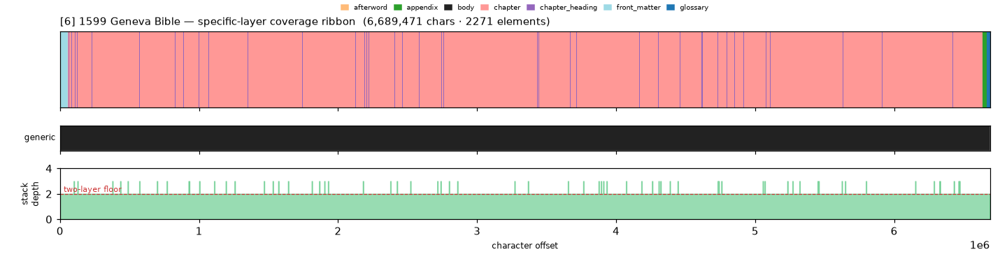
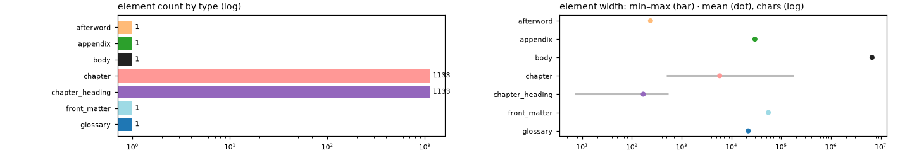

# Masking-Map Audit — [6] 1599 Geneva Bible

- **Source file:** `1599 Geneva Bible -- Tolle Lege Press [Press, Tolle Lege] -- 2013 -- Tolle Lege Press -- 19f28a695686af95cd3f5997c53aa3f2 -- Anna’s Archive.epub`
- **Text length:** 6,689,471 chars
- **Mask elements (complete map):** 2,271
- **Distinct mask types:** 7 (1 generic, 6 specific)
- **Status:** ✅ COMPLETE — 100% two-layer, 0 sparse regions

## What this audits

The **gold's own intended masking map** — every mask element typed by close reading with exact, materialized per-instance boundaries (NOT the production detector's output). **Generic** = `body, volume, book, part` (broad containers). **Specific** = the other 30 types, including `chapter`. **Gate:** every character carries ≥1 generic AND ≥1 specific mask; `body[0,EOF]` is the universal generic base, so the specific layer must tile 100%.

## Coverage summary

| Class | Chars | % of text |
|---|---:|---:|
| ✅ covered (≥1 generic + ≥1 specific) | 6,689,471 | 100.00% |
| generic-only | 0 | 0.00% |
| specific-only | 0 | 0.00% |
| uncovered | 0 | 0.00% |

**Two-layer coverage: 100.00%.** Sparse regions (generic-only or specific-only): **0** (0 chars).

## Masking-map layout (specific layer, linearized left→right)

```
thhhhhhhhhhhhhhhhhhhhhhhhhhhhhhhhhhhhhhhhhhhhhhhhhhhhhhhhhhhhhhhhhhhhhhhhhhhhhhhhhhhhhhhhhhhhhhe
```
<sub>e=appendix  h=chapter  t=front_matter</sub>



*(Ribbon = innermost specific type per cell; the generic layer + mask-stack-depth profile — showing the ≥2 two-layer floor — are in the figure above.)*

## Mask-type breakdown (all 34 types, including 0-counts)

| type | layer | count | width min / median / max | total chars |
|---|---|---:|---:|---:|
| about_author | specific | 0  | — | — |
| acknowledgments | specific | 0  | — | — |
| addendum | specific | 0  | — | — |
| **afterword** | specific | 1 | 236 / 236 / 236 | 236 |
| **appendix** | specific | 1 | 29,642 / 29,642 / 29,642 | 29,642 |
| back_matter | specific | 0  | — | — |
| bibliography | specific | 0  | — | — |
| **body** | generic | 1 | 6,689,471 / 6,689,471 / 6,689,471 | 6,689,471 |
| book | generic | 0  | — | — |
| **chapter** | specific | 1133 | 490 / 3,866 / 176,831 | 6,582,495 |
| **chapter_heading** | specific | 1133 | 7 / 165 / 540 | 191,529 |
| colophon | specific | 0  | — | — |
| commentary | specific | 0  | — | — |
| contents | specific | 0  | — | — |
| copyright | specific | 0  | — | — |
| dedication | specific | 0  | — | — |
| discussion | specific | 0  | — | — |
| endnotes | specific | 0  | — | — |
| epigraph | specific | 0  | — | — |
| footnotes | specific | 0  | — | — |
| foreword | specific | 0  | — | — |
| **front_matter** | specific | 1 | 55,323 / 55,323 / 55,323 | 55,323 |
| **glossary** | specific | 1 | 21,775 / 21,775 / 21,775 | 21,775 |
| header | specific | 0  | — | — |
| index | specific | 0  | — | — |
| insert | specific | 0  | — | — |
| introduction | specific | 0  | — | — |
| letter | specific | 0  | — | — |
| part | generic | 0  | — | — |
| poetry | specific | 0  | — | — |
| preface | specific | 0  | — | — |
| title_page | specific | 0  | — | — |
| translation | specific | 0  | — | — |
| volume | generic | 0  | — | — |

## Per-instance edges & rules

| structure | role | count | materialization |
|---|---|---:|---|
| chapter_heading | primary | 1133 | `regex_in_span` ✏️ corrected |
| book | secondary | 66 | `—` ✏️ corrected |

**Count corrections this build:**

- `chapter_heading` → **1133** — None→1133): one numbered 'argument'/superscription block precedes each chapter's verse 1.
- `book` → **66** — None→66): 39 OT + 27 NT; the Apocrypha (Ecclesiasticus, Maccabees, Esdras, Tobit, Judith, Wisdom, Baruch, Manasses) are entirely ABSENT in this e-text.

## Element-width distribution by type



---

<sub>Generated from the gold-intended masking map (`.scratch/mask-eval/masking_map.py`); detector not consulted. Coordinates character-exact from `reference_text()`. Part of the [unified audit portfolio](../portfolio/index.html).</sub>
