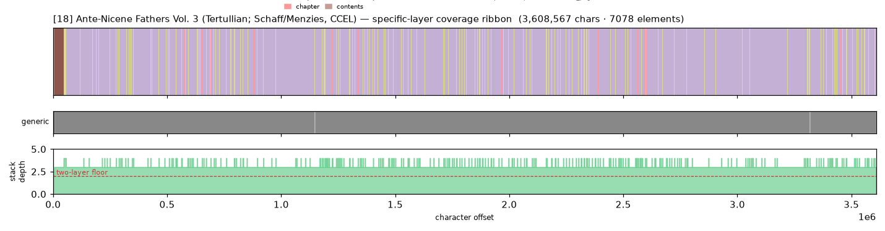
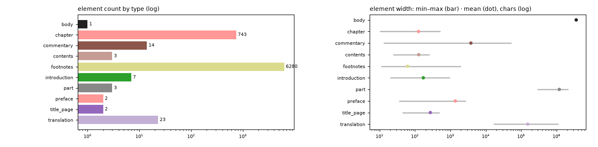

# Masking-Map Audit — [18] Ante-Nicene Fathers Vol. 3 (Tertullian; Schaff/Menzies, CCEL)

- **Source file:** `Ante-Nicene Fathers Volume 3 - Enhanced Version -- Philip Schaff [Schaff, Philip] -- Ante-Nicene Fathers Volume 3, 2009 -- Christian Classics Ethereal -- eef3b5fa6fe129392d6fb890c5b5ca85 -- Anna’s Archive.epub`
- **Text length:** 3,608,567 chars
- **Mask elements (complete map):** 7,078
- **Distinct mask types:** 10 (2 generic, 8 specific)
- **Status:** ✅ COMPLETE — 100% two-layer, 0 sparse regions

## What this audits

The **gold's own intended masking map** — every mask element typed by close reading with exact, materialized per-instance boundaries (NOT the production detector's output). **Generic** = `body, volume, book, part` (broad containers). **Specific** = the other 30 types, including `chapter`. **Gate:** every character carries ≥1 generic AND ≥1 specific mask; `body[0,EOF]` is the universal generic base, so the specific layer must tile 100%.

## Coverage summary

| Class | Chars | % of text |
|---|---:|---:|
| ✅ covered (≥1 generic + ≥1 specific) | 3,608,567 | 100.00% |
| generic-only | 0 | 0.00% |
| specific-only | 0 | 0.00% |
| uncovered | 0 | 0.00% |

**Two-layer coverage: 100.00%.** Sparse regions (generic-only or specific-only): **0** (0 chars).

## Masking-map layout (specific layer, linearized left→right)

```
kkDDDDDDDDDDDDDDDDDDDDDDDDDDDDDDDDDDDDDDDDDDDDDDDDDDDDDDDDDDDDDDDDDDDDDDDDDDDDDDDDDDDDDDDDDDDDDD
```
<sub>D=translation  k=commentary</sub>



*(Ribbon = innermost specific type per cell; the generic layer + mask-stack-depth profile — showing the ≥2 two-layer floor — are in the figure above.)*

## Mask-type breakdown (all 34 types, including 0-counts)

| type | layer | count | width min / median / max | total chars |
|---|---|---:|---:|---:|
| about_author | specific | 0  | — | — |
| acknowledgments | specific | 0  | — | — |
| addendum | specific | 0  | — | — |
| afterword | specific | 0  | — | — |
| appendix | specific | 0  | — | — |
| back_matter | specific | 0  | — | — |
| bibliography | specific | 0  | — | — |
| **body** | generic | 1 | 3,608,567 / 3,608,567 / 3,608,567 | 3,608,567 |
| book | generic | 0  | — | — |
| **chapter** | specific | 743 | 10 / 115 / 521 | 93,834 |
| chapter_heading | specific | 0  | — | — |
| colophon | specific | 0  | — | — |
| **commentary** | specific | 14 | 13 / 13 / 53,216 | 53,385 |
| **contents** | specific | 3 | 24 / 104 / 255 | 383 |
| copyright | specific | 0  | — | — |
| dedication | specific | 0  | — | — |
| discussion | specific | 0  | — | — |
| endnotes | specific | 0  | — | — |
| epigraph | specific | 0  | — | — |
| **footnotes** | specific | 6280 | 11 / 28 / 1,999 | 391,363 |
| foreword | specific | 0  | — | — |
| front_matter | specific | 0  | — | — |
| glossary | specific | 0  | — | — |
| header | specific | 0  | — | — |
| index | specific | 0  | — | — |
| insert | specific | 0  | — | — |
| **introduction** | specific | 7 | 20 / 38 / 977 | 1,206 |
| letter | specific | 0  | — | — |
| **part** | generic | 3 | 290,103 / 1,142,704 / 2,171,061 | 3,603,868 |
| poetry | specific | 0  | — | — |
| **preface** | specific | 2 | 35 / 1,382 / 2,730 | 2,765 |
| **title_page** | specific | 2 | 44 / 271 / 499 | 543 |
| **translation** | specific | 23 | 16,420 / 96,457 / 1,117,768 | 3,550,652 |
| volume | generic | 0  | — | — |

## Per-instance edges & rules

| structure | role | count | materialization |
|---|---|---:|---|
| part | secondary | 3 | `regex_in_span`  |
| translation | primary | 23 | `regex_in_span`  |
| commentary | secondary | 13 | `regex_in_span`  |
| introduction | secondary | 5 | `regex_in_span`  |
| chapter | secondary | 743 | `regex_in_span` ✏️ corrected |
| footnotes | primary | 6280 | `regex_in_span`  |

**Count corrections this build:**

- `chapter` → **743** — 737→743): in-body 'Chapter <roman>.' headings, negative-lookahead isolated from contents-list echoes, leakage-free (737 was the detector's de-dup count).

## Element-width distribution by type



---

<sub>Generated from the gold-intended masking map (`.scratch/mask-eval/masking_map.py`); detector not consulted. Coordinates character-exact from `reference_text()`. Part of the [unified audit portfolio](../portfolio/index.html).</sub>
