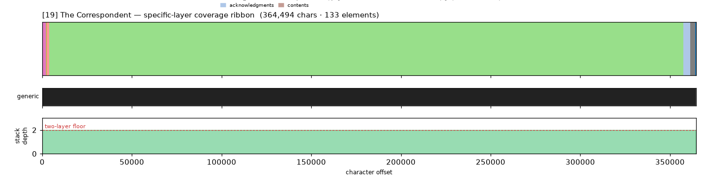
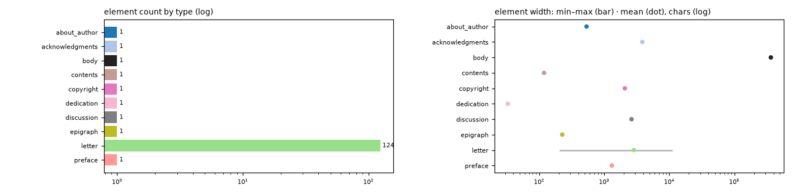

# Masking-Map Audit — [19] The Correspondent

- **Source file:** `The Correspondent_ A Novel -- Virginia Evans -- 2025 -- Crown Publishing Group, The -- isbn13 9780593798430 -- f542b169cc729ca2fdc329d48c3911f5 -- Anna’s Archive.epub`
- **Text length:** 364,494 chars
- **Mask elements (complete map):** 133
- **Distinct mask types:** 10 (1 generic, 9 specific)
- **Status:** ✅ COMPLETE — 100% two-layer, 0 sparse regions

## What this audits

The **gold's own intended masking map** — every mask element typed by close reading with exact, materialized per-instance boundaries (NOT the production detector's output). **Generic** = `body, volume, book, part` (broad containers). **Specific** = the other 30 types, including `chapter`. **Gate:** every character carries ≥1 generic AND ≥1 specific mask; `body[0,EOF]` is the universal generic base, so the specific layer must tile 100%.

## Coverage summary

| Class | Chars | % of text |
|---|---:|---:|
| ✅ covered (≥1 generic + ≥1 specific) | 364,494 | 100.00% |
| generic-only | 0 | 0.00% |
| specific-only | 0 | 0.00% |
| uncovered | 0 | 0.00% |

**Two-layer coverage: 100.00%.** Sparse regions (generic-only or specific-only): **0** (0 chars).

## Masking-map layout (specific layer, linearized left→right)

```
mzzzzzzzzzzzzzzzzzzzzzzzzzzzzzzzzzzzzzzzzzzzzzzzzzzzzzzzzzzzzzzzzzzzzzzzzzzzzzzzzzzzzzzzzzzzzzbo
```
<sub>b=acknowledgments  m=copyright  o=discussion  z=letter</sub>



*(Ribbon = innermost specific type per cell; the generic layer + mask-stack-depth profile — showing the ≥2 two-layer floor — are in the figure above.)*

## Mask-type breakdown (all 34 types, including 0-counts)

| type | layer | count | width min / median / max | total chars |
|---|---|---:|---:|---:|
| **about_author** | specific | 1 | 535 / 535 / 535 | 535 |
| **acknowledgments** | specific | 1 | 3,857 / 3,857 / 3,857 | 3,857 |
| addendum | specific | 0  | — | — |
| afterword | specific | 0  | — | — |
| appendix | specific | 0  | — | — |
| back_matter | specific | 0  | — | — |
| bibliography | specific | 0  | — | — |
| **body** | generic | 1 | 364,494 / 364,494 / 364,494 | 364,494 |
| book | generic | 0  | — | — |
| chapter | specific | 0  | — | — |
| chapter_heading | specific | 0  | — | — |
| colophon | specific | 0  | — | — |
| commentary | specific | 0  | — | — |
| **contents** | specific | 1 | 119 / 119 / 119 | 119 |
| **copyright** | specific | 1 | 2,075 / 2,075 / 2,075 | 2,075 |
| **dedication** | specific | 1 | 33 / 33 / 33 | 33 |
| **discussion** | specific | 1 | 2,634 / 2,634 / 2,634 | 2,634 |
| endnotes | specific | 0  | — | — |
| **epigraph** | specific | 1 | 227 / 227 / 227 | 227 |
| footnotes | specific | 0  | — | — |
| foreword | specific | 0  | — | — |
| front_matter | specific | 0  | — | — |
| glossary | specific | 0  | — | — |
| header | specific | 0  | — | — |
| index | specific | 0  | — | — |
| insert | specific | 0  | — | — |
| introduction | specific | 0  | — | — |
| **letter** | specific | 124 | 206 / 2,126 / 11,274 | 353,701 |
| part | generic | 0  | — | — |
| poetry | specific | 0  | — | — |
| **preface** | specific | 1 | 1,313 / 1,313 / 1,313 | 1,313 |
| title_page | specific | 0  | — | — |
| translation | specific | 0  | — | — |
| volume | generic | 0  | — | — |

## Per-instance edges & rules

| structure | role | count | materialization |
|---|---|---:|---|
| letter | primary | 124 | `salutation` ✏️ corrected |

**Count corrections this build:**

- `letter` → **124** — 102→124): salutation discriminator (115 greeting-prefix + 9 bare-name forms); the prior 102 was a 'Dear'-only proxy lower bound.

## Element-width distribution by type



---

<sub>Generated from the gold-intended masking map (`.scratch/mask-eval/masking_map.py`); detector not consulted. Coordinates character-exact from `reference_text()`. Part of the [unified audit portfolio](../portfolio/index.html).</sub>
