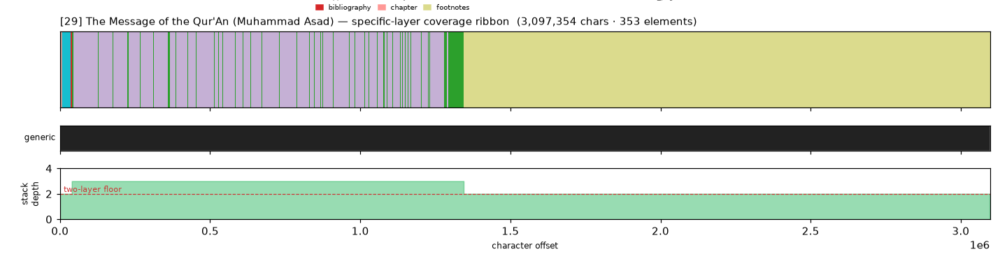
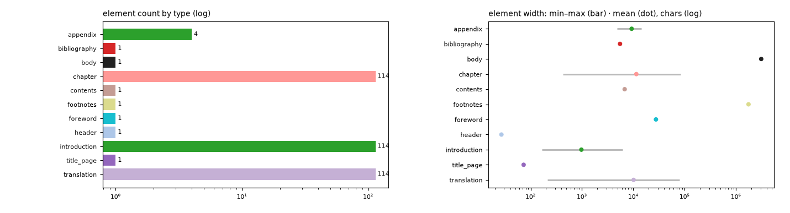

# Masking-Map Audit — [29] The Message of the Qur'An (Muhammad Asad)

- **Source file:** `The Message of the Qur'An -- Muhammad Asad [Asad, Muhammad] -- Place of publication not identified, 1980 -- The Book Foundation -- isbn13 9780317524567 -- f720bfc6c8902fb7c76dbd9aa6f64f30 -- Anna’s Archive.epub`
- **Text length:** 3,097,354 chars
- **Mask elements (complete map):** 353
- **Distinct mask types:** 11 (1 generic, 10 specific)
- **Status:** ✅ COMPLETE — 100% two-layer, 0 sparse regions

## What this audits

The **gold's own intended masking map** — every mask element typed by close reading with exact, materialized per-instance boundaries (NOT the production detector's output). **Generic** = `body, volume, book, part` (broad containers). **Specific** = the other 30 types, including `chapter`. **Gate:** every character carries ≥1 generic AND ≥1 specific mask; `body[0,EOF]` is the universal generic base, so the specific layer must tile 100%.

## Coverage summary

| Class | Chars | % of text |
|---|---:|---:|
| ✅ covered (≥1 generic + ≥1 specific) | 3,097,354 | 100.00% |
| generic-only | 0 | 0.00% |
| specific-only | 0 | 0.00% |
| uncovered | 0 | 0.00% |

**Two-layer coverage: 100.00%.** Sparse regions (generic-only or specific-only): **0** (0 chars).

## Masking-map layout (specific layer, linearized left→right)

```
shhhhhhhhhhhhhhhhhhhhhhhhhhhhhhhhhhhhhhhhhrrrrrrrrrrrrrrrrrrrrrrrrrrrrrrrrrrrrrrrrrrrrrrrrrrrrrr
```
<sub>h=chapter  r=footnotes  s=foreword</sub>



*(Ribbon = innermost specific type per cell; the generic layer + mask-stack-depth profile — showing the ≥2 two-layer floor — are in the figure above.)*

## Mask-type breakdown (all 34 types, including 0-counts)

| type | layer | count | width min / median / max | total chars |
|---|---|---:|---:|---:|
| about_author | specific | 0  | — | — |
| acknowledgments | specific | 0  | — | — |
| addendum | specific | 0  | — | — |
| afterword | specific | 0  | — | — |
| **appendix** | specific | 4 | 4,770 / 8,958 / 14,417 | 37,104 |
| back_matter | specific | 0  | — | — |
| **bibliography** | specific | 1 | 5,506 / 5,506 / 5,506 | 5,506 |
| **body** | generic | 1 | 3,097,354 / 3,097,354 / 3,097,354 | 3,097,354 |
| book | generic | 0  | — | — |
| **chapter** | specific | 114 | 422 / 6,242 / 82,623 | 1,304,224 |
| chapter_heading | specific | 0  | — | — |
| colophon | specific | 0  | — | — |
| commentary | specific | 0  | — | — |
| **contents** | specific | 1 | 6,783 / 6,783 / 6,783 | 6,783 |
| copyright | specific | 0  | — | — |
| dedication | specific | 0  | — | — |
| discussion | specific | 0  | — | — |
| endnotes | specific | 0  | — | — |
| epigraph | specific | 0  | — | — |
| **footnotes** | specific | 1 | 1,753,169 / 1,753,169 / 1,753,169 | 1,753,169 |
| **foreword** | specific | 1 | 27,572 / 27,572 / 27,572 | 27,572 |
| front_matter | specific | 0  | — | — |
| glossary | specific | 0  | — | — |
| **header** | specific | 1 | 27 / 27 / 27 | 27 |
| index | specific | 0  | — | — |
| insert | specific | 0  | — | — |
| **introduction** | specific | 114 | 168 / 679 / 6,248 | 111,004 |
| letter | specific | 0  | — | — |
| part | generic | 0  | — | — |
| poetry | specific | 0  | — | — |
| preface | specific | 0  | — | — |
| **title_page** | specific | 1 | 73 / 73 / 73 | 73 |
| **translation** | specific | 114 | 211 / 5,535 / 80,064 | 1,156,116 |
| volume | generic | 0  | — | — |

## Per-instance edges & rules

| structure | role | count | materialization |
|---|---|---:|---|
| chapter | secondary | 114 | `regex_in_span`  |
| introduction | primary | 114 | `computed_offsets`  |
| translation | primary | 114 | `computed_offsets`  |
| footnotes | primary | 5326 | `computed_offsets`  |
| appendix | secondary | 4 | `regex_in_span`  |

## Element-width distribution by type



---

<sub>Generated from the gold-intended masking map (`.scratch/mask-eval/masking_map.py`); detector not consulted. Coordinates character-exact from `reference_text()`. Part of the [unified audit portfolio](../portfolio/index.html).</sub>
