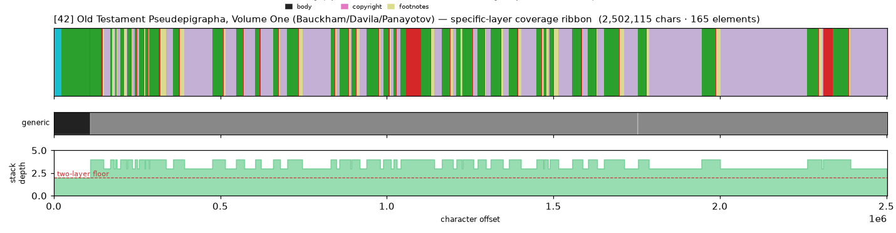
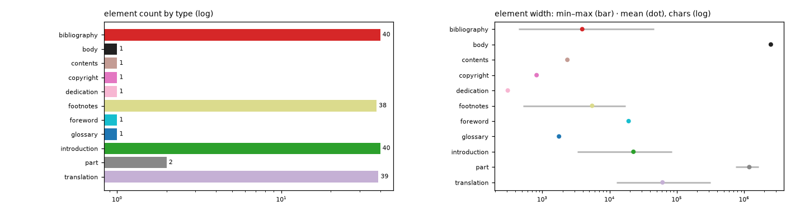

# Masking-Map Audit — [42] Old Testament Pseudepigrapha, Volume One (Bauckham/Davila/Panayotov)

- **Source file:** `Old Testament pseudepigrapha_ Volume one _ More noncanonical -- Richard Bauckham; James R Davila; Alexander Panayotov; James -- INscribe Digital, -- isbn13 9780802827395 -- aab44f565a88b493ecb8ef452087ff78 -- Anna’s Archive.epub`
- **Text length:** 2,502,115 chars
- **Mask elements (complete map):** 165
- **Distinct mask types:** 11 (2 generic, 9 specific)
- **Status:** ✅ COMPLETE — 100% two-layer, 0 sparse regions

## What this audits

The **gold's own intended masking map** — every mask element typed by close reading with exact, materialized per-instance boundaries (NOT the production detector's output). **Generic** = `body, volume, book, part` (broad containers). **Specific** = the other 30 types, including `chapter`. **Gate:** every character carries ≥1 generic AND ≥1 specific mask; `body[0,EOF]` is the universal generic base, so the specific layer must tile 100%.

## Coverage summary

| Class | Chars | % of text |
|---|---:|---:|
| ✅ covered (≥1 generic + ≥1 specific) | 2,502,115 | 100.00% |
| generic-only | 0 | 0.00% |
| specific-only | 0 | 0.00% |
| uncovered | 0 | 0.00% |

**Two-layer coverage: 100.00%.** Sparse regions (generic-only or specific-only): **0** (0 chars).

## Masking-map layout (specific layer, linearized left→right)

```
syyyDDDDDDDDDDDDDDDDDDDDDDDDDDDDDDDDDDDDDDDDDDDDDDDDDDDDDDDDDDDDDDDDDDDDDDDDDDDDDDDDDDDDDDDDDDDD
```
<sub>D=translation  s=foreword  y=introduction</sub>



*(Ribbon = innermost specific type per cell; the generic layer + mask-stack-depth profile — showing the ≥2 two-layer floor — are in the figure above.)*

## Mask-type breakdown (all 34 types, including 0-counts)

| type | layer | count | width min / median / max | total chars |
|---|---|---:|---:|---:|
| about_author | specific | 0  | — | — |
| acknowledgments | specific | 0  | — | — |
| addendum | specific | 0  | — | — |
| afterword | specific | 0  | — | — |
| appendix | specific | 0  | — | — |
| back_matter | specific | 0  | — | — |
| **bibliography** | specific | 40 | 444 / 2,014 / 45,503 | 157,025 |
| **body** | generic | 1 | 2,502,115 / 2,502,115 / 2,502,115 | 2,502,115 |
| book | generic | 0  | — | — |
| chapter | specific | 0  | — | — |
| chapter_heading | specific | 0  | — | — |
| colophon | specific | 0  | — | — |
| commentary | specific | 0  | — | — |
| **contents** | specific | 1 | 2,360 / 2,360 / 2,360 | 2,360 |
| **copyright** | specific | 1 | 823 / 823 / 823 | 823 |
| **dedication** | specific | 1 | 307 / 307 / 307 | 307 |
| discussion | specific | 0  | — | — |
| endnotes | specific | 0  | — | — |
| epigraph | specific | 0  | — | — |
| **footnotes** | specific | 38 | 518 / 4,153 / 17,103 | 209,416 |
| **foreword** | specific | 1 | 19,220 / 19,220 / 19,220 | 19,220 |
| front_matter | specific | 0  | — | — |
| **glossary** | specific | 1 | 1,772 / 1,772 / 1,772 | 1,772 |
| header | specific | 0  | — | — |
| index | specific | 0  | — | — |
| insert | specific | 0  | — | — |
| **introduction** | specific | 40 | 3,333 / 20,511 / 85,221 | 906,070 |
| letter | specific | 0  | — | — |
| **part** | generic | 2 | 747,506 / 1,196,206 / 1,644,906 | 2,392,412 |
| poetry | specific | 0  | — | — |
| preface | specific | 0  | — | — |
| title_page | specific | 0  | — | — |
| **translation** | specific | 39 | 12,656 / 47,083 / 317,244 | 2,392,412 |
| volume | generic | 0  | — | — |

## Per-instance edges & rules

| structure | role | count | materialization |
|---|---|---:|---|
| part | secondary | 2 | `computed_offsets`  |
| translation | primary | 39 | `computed_offsets`  |
| introduction | secondary | 40 | `computed_offsets`  |
| bibliography | secondary | 40 | `computed_offsets`  |
| footnotes | secondary | None | `computed_offsets`  |

## Element-width distribution by type



---

<sub>Generated from the gold-intended masking map (`.scratch/mask-eval/masking_map.py`); detector not consulted. Coordinates character-exact from `reference_text()`. Part of the [unified audit portfolio](../portfolio/index.html).</sub>
