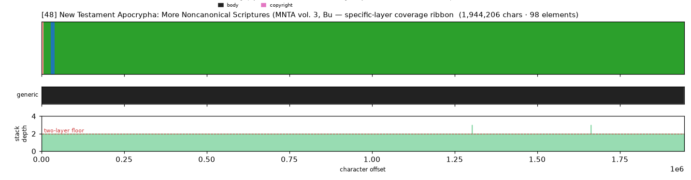
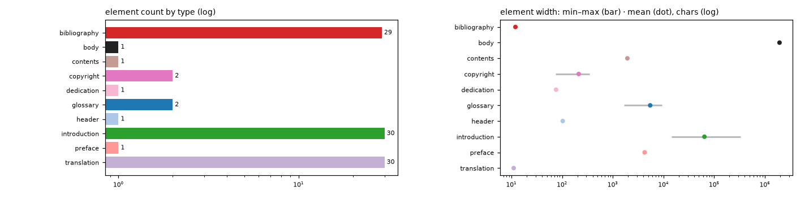

# Masking-Map Audit — [48] New Testament Apocrypha: More Noncanonical Scriptures (MNTA vol. 3, Burke ed.)

- **Source file:** `New Testament apocrypha _ more noncanonical scriptures_ -- Tony Burke; Brent Landau -- Grand Rapids, Michigan, 2016 -- Eerdmans Publishing Company, -- isbn13 9780802872890 -- 99bbecbce461db3b220b58e59c569acc -- Anna’s Archive.epub`
- **Text length:** 1,944,206 chars
- **Mask elements (complete map):** 98
- **Distinct mask types:** 10 (1 generic, 9 specific)
- **Status:** ✅ COMPLETE — 100% two-layer, 0 sparse regions

## What this audits

The **gold's own intended masking map** — every mask element typed by close reading with exact, materialized per-instance boundaries (NOT the production detector's output). **Generic** = `body, volume, book, part` (broad containers). **Specific** = the other 30 types, including `chapter`. **Gate:** every character carries ≥1 generic AND ≥1 specific mask; `body[0,EOF]` is the universal generic base, so the specific layer must tile 100%.

## Coverage summary

| Class | Chars | % of text |
|---|---:|---:|
| ✅ covered (≥1 generic + ≥1 specific) | 1,944,206 | 100.00% |
| generic-only | 0 | 0.00% |
| specific-only | 0 | 0.00% |
| uncovered | 0 | 0.00% |

**Two-layer coverage: 100.00%.** Sparse regions (generic-only or specific-only): **0** (0 chars).

## Masking-map layout (specific layer, linearized left→right)

```
yuyyyyyyyyyyyyyyyyyyyyyyyyyyyyyyyyyyyyyyyyyyyyyyyyyyyyyyyyyyyyyyyyyyyyyyyyyyyyyyyyyyyyyyyyyyyyyy
```
<sub>u=glossary  y=introduction</sub>



*(Ribbon = innermost specific type per cell; the generic layer + mask-stack-depth profile — showing the ≥2 two-layer floor — are in the figure above.)*

## Mask-type breakdown (all 34 types, including 0-counts)

| type | layer | count | width min / median / max | total chars |
|---|---|---:|---:|---:|
| about_author | specific | 0  | — | — |
| acknowledgments | specific | 0  | — | — |
| addendum | specific | 0  | — | — |
| afterword | specific | 0  | — | — |
| appendix | specific | 0  | — | — |
| back_matter | specific | 0  | — | — |
| **bibliography** | specific | 29 | 12 / 12 / 12 | 348 |
| **body** | generic | 1 | 1,944,206 / 1,944,206 / 1,944,206 | 1,944,206 |
| book | generic | 0  | — | — |
| chapter | specific | 0  | — | — |
| chapter_heading | specific | 0  | — | — |
| colophon | specific | 0  | — | — |
| commentary | specific | 0  | — | — |
| **contents** | specific | 1 | 1,940 / 1,940 / 1,940 | 1,940 |
| **copyright** | specific | 2 | 75 / 212 / 350 | 425 |
| **dedication** | specific | 1 | 76 / 76 / 76 | 76 |
| discussion | specific | 0  | — | — |
| endnotes | specific | 0  | — | — |
| epigraph | specific | 0  | — | — |
| footnotes | specific | 0  | — | — |
| foreword | specific | 0  | — | — |
| front_matter | specific | 0  | — | — |
| **glossary** | specific | 2 | 1,652 / 5,466 / 9,280 | 10,932 |
| **header** | specific | 1 | 103 / 103 / 103 | 103 |
| index | specific | 0  | — | — |
| insert | specific | 0  | — | — |
| **introduction** | specific | 30 | 14,449 / 50,300 / 333,499 | 1,926,478 |
| letter | specific | 0  | — | — |
| part | generic | 0  | — | — |
| poetry | specific | 0  | — | — |
| **preface** | specific | 1 | 4,252 / 4,252 / 4,252 | 4,252 |
| title_page | specific | 0  | — | — |
| **translation** | specific | 30 | 11 / 11 / 12 | 333 |
| volume | generic | 0  | — | — |

## Per-instance edges & rules

| structure | role | count | materialization |
|---|---|---:|---|
| part | secondary | 4 | `—`  |
| book | secondary | 29 | `—`  |
| introduction | primary | 29 | `regex_in_span`  |
| translation | primary | 29 | `regex_in_span`  |
| bibliography | primary | 29 | `regex_in_span`  |
| footnotes | secondary | None | `—`  |

## Element-width distribution by type



---

<sub>Generated from the gold-intended masking map (`.scratch/mask-eval/masking_map.py`); detector not consulted. Coordinates character-exact from `reference_text()`. Part of the [unified audit portfolio](../portfolio/index.html).</sub>
