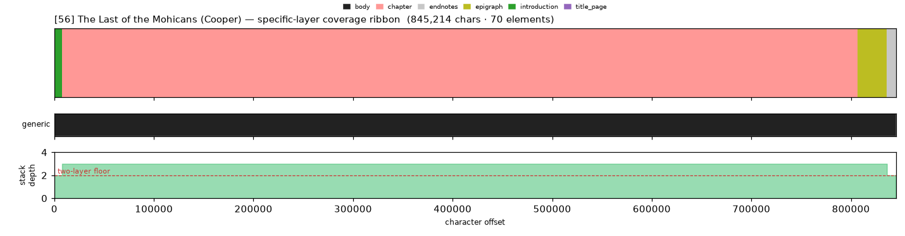
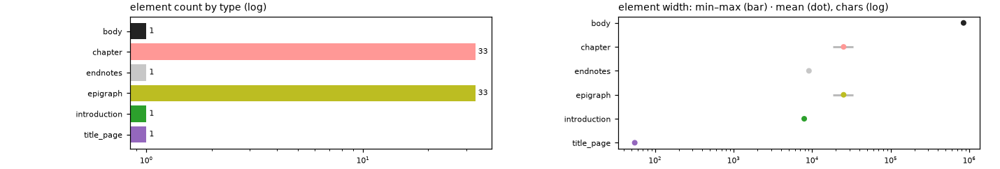

# Masking-Map Audit — [56] The Last of the Mohicans (Cooper)

- **Source file:** `The Last of the Mohicans -- Cooper, James Fenimore -- The Leatherstocking Tales 2, 1919 -- C_ Scribner's sons -- isbn13 9785551075097 -- 1164165e8537a4b55cd9c0d05ff87858 -- Anna’s Archive.epub`
- **Text length:** 845,214 chars
- **Mask elements (complete map):** 70
- **Distinct mask types:** 6 (1 generic, 5 specific)
- **Status:** ✅ COMPLETE — 100% two-layer, 0 sparse regions

## What this audits

The **gold's own intended masking map** — every mask element typed by close reading with exact, materialized per-instance boundaries (NOT the production detector's output). **Generic** = `body, volume, book, part` (broad containers). **Specific** = the other 30 types, including `chapter`. **Gate:** every character carries ≥1 generic AND ≥1 specific mask; `body[0,EOF]` is the universal generic base, so the specific layer must tile 100%.

## Coverage summary

| Class | Chars | % of text |
|---|---:|---:|
| ✅ covered (≥1 generic + ≥1 specific) | 845,214 | 100.00% |
| generic-only | 0 | 0.00% |
| specific-only | 0 | 0.00% |
| uncovered | 0 | 0.00% |

**Two-layer coverage: 100.00%.** Sparse regions (generic-only or specific-only): **0** (0 chars).

## Masking-map layout (specific layer, linearized left→right)

```
yqqhqqqqqqqqhqqqqqqqhqhqqhqqhqqqhqqqqqhqqhqqqqqqqqhqqqqqqqqhqqhqqqqqqqqqqqqqqhqqqqqqqqqqqqqqqqqp
```
<sub>h=chapter  p=endnotes  q=epigraph  y=introduction</sub>



*(Ribbon = innermost specific type per cell; the generic layer + mask-stack-depth profile — showing the ≥2 two-layer floor — are in the figure above.)*

## Mask-type breakdown (all 34 types, including 0-counts)

| type | layer | count | width min / median / max | total chars |
|---|---|---:|---:|---:|
| about_author | specific | 0  | — | — |
| acknowledgments | specific | 0  | — | — |
| addendum | specific | 0  | — | — |
| afterword | specific | 0  | — | — |
| appendix | specific | 0  | — | — |
| back_matter | specific | 0  | — | — |
| bibliography | specific | 0  | — | — |
| **body** | generic | 1 | 845,214 / 845,214 / 845,214 | 845,214 |
| book | generic | 0  | — | — |
| **chapter** | specific | 33 | 18,219 / 25,141 / 33,481 | 828,157 |
| chapter_heading | specific | 0  | — | — |
| colophon | specific | 0  | — | — |
| commentary | specific | 0  | — | — |
| contents | specific | 0  | — | — |
| copyright | specific | 0  | — | — |
| dedication | specific | 0  | — | — |
| discussion | specific | 0  | — | — |
| **endnotes** | specific | 1 | 9,091 / 9,091 / 9,091 | 9,091 |
| **epigraph** | specific | 33 | 18,219 / 25,141 / 33,481 | 828,146 |
| footnotes | specific | 0  | — | — |
| foreword | specific | 0  | — | — |
| front_matter | specific | 0  | — | — |
| glossary | specific | 0  | — | — |
| header | specific | 0  | — | — |
| index | specific | 0  | — | — |
| insert | specific | 0  | — | — |
| **introduction** | specific | 1 | 7,911 / 7,911 / 7,911 | 7,911 |
| letter | specific | 0  | — | — |
| part | generic | 0  | — | — |
| poetry | specific | 0  | — | — |
| preface | specific | 0  | — | — |
| **title_page** | specific | 1 | 55 / 55 / 55 | 55 |
| translation | specific | 0  | — | — |
| volume | generic | 0  | — | — |

## Per-instance edges & rules

| structure | role | count | materialization |
|---|---|---:|---|
| epigraph | primary | 33 | `regex_in_span`  |
| chapter | secondary | 33 | `regex_in_span`  |

## Element-width distribution by type



---

<sub>Generated from the gold-intended masking map (`.scratch/mask-eval/masking_map.py`); detector not consulted. Coordinates character-exact from `reference_text()`. Part of the [unified audit portfolio](../portfolio/index.html).</sub>
