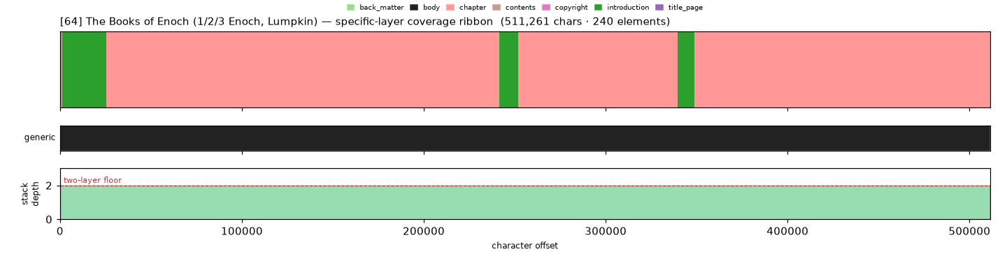
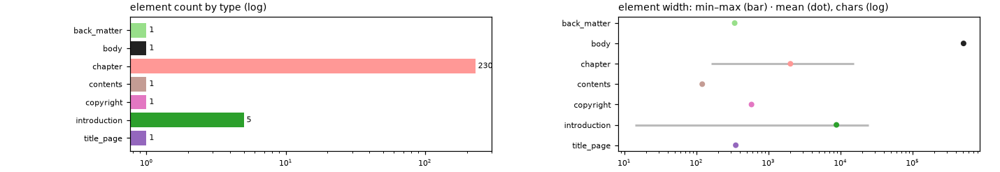

# Masking-Map Audit — [64] The Books of Enoch (1/2/3 Enoch, Lumpkin)

- **Source file:** `The Books of Enoch_ A Complete Volume Containing 1 Enoch -- Enoch & Joseph B_ Lumpkin [Enoch & Lumpkin, Joseph B_] -- 2009 -- Fifth Estate, -- isbn13 9781933580807 -- 6d9f4271e0a52f5b84fa059abc2857c0 -- Anna’s Archive.epub`
- **Text length:** 511,261 chars
- **Mask elements (complete map):** 240
- **Distinct mask types:** 7 (1 generic, 6 specific)
- **Status:** ✅ COMPLETE — 100% two-layer, 0 sparse regions

## What this audits

The **gold's own intended masking map** — every mask element typed by close reading with exact, materialized per-instance boundaries (NOT the production detector's output). **Generic** = `body, volume, book, part` (broad containers). **Specific** = the other 30 types, including `chapter`. **Gate:** every character carries ≥1 generic AND ≥1 specific mask; `body[0,EOF]` is the universal generic base, so the specific layer must tile 100%.

## Coverage summary

| Class | Chars | % of text |
|---|---:|---:|
| ✅ covered (≥1 generic + ≥1 specific) | 511,261 | 100.00% |
| generic-only | 0 | 0.00% |
| specific-only | 0 | 0.00% |
| uncovered | 0 | 0.00% |

**Two-layer coverage: 100.00%.** Sparse regions (generic-only or specific-only): **0** (0 chars).

## Masking-map layout (specific layer, linearized left→right)

```
yyyyyhhhhhhhhhhhhhhhhhhhhhhhhhhhhhhhhhhhhhhhhyyhhhhhhhhhhhhhhhhhyhhhhhhhhhhhhhhhhhhhhhhhhhhhhhhh
```
<sub>h=chapter  y=introduction</sub>



*(Ribbon = innermost specific type per cell; the generic layer + mask-stack-depth profile — showing the ≥2 two-layer floor — are in the figure above.)*

## Mask-type breakdown (all 34 types, including 0-counts)

| type | layer | count | width min / median / max | total chars |
|---|---|---:|---:|---:|
| about_author | specific | 0  | — | — |
| acknowledgments | specific | 0  | — | — |
| addendum | specific | 0  | — | — |
| afterword | specific | 0  | — | — |
| appendix | specific | 0  | — | — |
| **back_matter** | specific | 1 | 341 / 341 / 341 | 341 |
| bibliography | specific | 0  | — | — |
| **body** | generic | 1 | 511,261 / 511,261 / 511,261 | 511,261 |
| book | generic | 0  | — | — |
| **chapter** | specific | 230 | 161 / 1,354 / 15,372 | 465,848 |
| chapter_heading | specific | 0  | — | — |
| colophon | specific | 0  | — | — |
| commentary | specific | 0  | — | — |
| **contents** | specific | 1 | 121 / 121 / 121 | 121 |
| **copyright** | specific | 1 | 584 / 584 / 584 | 584 |
| dedication | specific | 0  | — | — |
| discussion | specific | 0  | — | — |
| endnotes | specific | 0  | — | — |
| epigraph | specific | 0  | — | — |
| footnotes | specific | 0  | — | — |
| foreword | specific | 0  | — | — |
| front_matter | specific | 0  | — | — |
| glossary | specific | 0  | — | — |
| header | specific | 0  | — | — |
| index | specific | 0  | — | — |
| insert | specific | 0  | — | — |
| **introduction** | specific | 5 | 14 / 9,259 / 24,293 | 44,014 |
| letter | specific | 0  | — | — |
| part | generic | 0  | — | — |
| poetry | specific | 0  | — | — |
| preface | specific | 0  | — | — |
| **title_page** | specific | 1 | 353 / 353 / 353 | 353 |
| translation | specific | 0  | — | — |
| volume | generic | 0  | — | — |

## Per-instance edges & rules

| structure | role | count | materialization |
|---|---|---:|---|
| book | secondary | 3 | `—`  |
| introduction | secondary | 2 | `—`  |
| chapter | primary | 230 | `multi` ✏️ corrected |

**Count corrections this build:**

- `chapter` → **230** — 228→230): 3 Enoch chapters 5 & 8 ARE present in this Lumpkin text, OCR'd 'CHAPTER S'; 108+68+54=230.

## Element-width distribution by type



---

<sub>Generated from the gold-intended masking map (`.scratch/mask-eval/masking_map.py`); detector not consulted. Coordinates character-exact from `reference_text()`. Part of the [unified audit portfolio](../portfolio/index.html).</sub>
