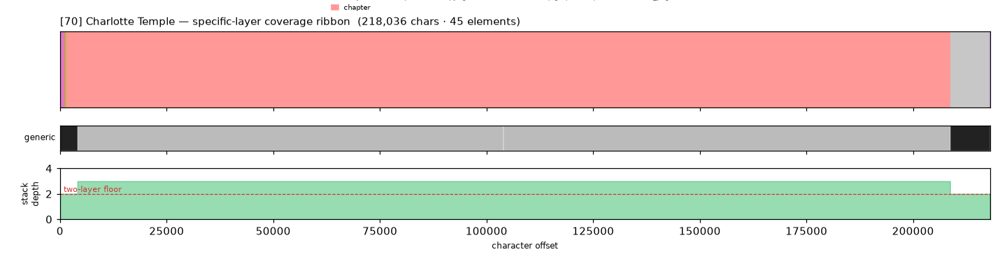
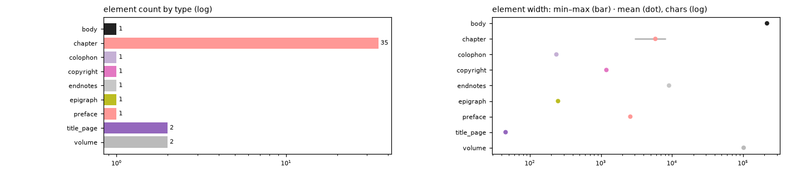

# Masking-Map Audit — [70] Charlotte Temple

- **Source file:** `Charlotte Temple -- Rowson, Susanna Haswell -- 2022 -- Standard Ebooks -- 8491224f92259d041f364596501e9f9a -- Anna’s Archive.epub`
- **Text length:** 218,036 chars
- **Mask elements (complete map):** 45
- **Distinct mask types:** 9 (2 generic, 7 specific)
- **Status:** ✅ COMPLETE — 100% two-layer, 0 sparse regions

## What this audits

The **gold's own intended masking map** — every mask element typed by close reading with exact, materialized per-instance boundaries (NOT the production detector's output). **Generic** = `body, volume, book, part` (broad containers). **Specific** = the other 30 types, including `chapter`. **Gate:** every character carries ≥1 generic AND ≥1 specific mask; `body[0,EOF]` is the universal generic base, so the specific layer must tile 100%.

## Coverage summary

| Class | Chars | % of text |
|---|---:|---:|
| ✅ covered (≥1 generic + ≥1 specific) | 218,036 | 100.00% |
| generic-only | 0 | 0.00% |
| specific-only | 0 | 0.00% |
| uncovered | 0 | 0.00% |

**Two-layer coverage: 100.00%.** Sparse regions (generic-only or specific-only): **0** (0 chars).

## Masking-map layout (specific layer, linearized left→right)

```
mBhhhhhhhhhhhhhhhhhhhhhhhhhhhhhhhhhhhhhhhhhhhhhhhhhhhhhhhhhhhhhhhhhhhhhhhhhhhhhhhhhhhhhhhhhhpppp
```
<sub>B=preface  h=chapter  m=copyright  p=endnotes</sub>



*(Ribbon = innermost specific type per cell; the generic layer + mask-stack-depth profile — showing the ≥2 two-layer floor — are in the figure above.)*

## Mask-type breakdown (all 34 types, including 0-counts)

| type | layer | count | width min / median / max | total chars |
|---|---|---:|---:|---:|
| about_author | specific | 0  | — | — |
| acknowledgments | specific | 0  | — | — |
| addendum | specific | 0  | — | — |
| afterword | specific | 0  | — | — |
| appendix | specific | 0  | — | — |
| back_matter | specific | 0  | — | — |
| bibliography | specific | 0  | — | — |
| **body** | generic | 1 | 218,036 / 218,036 / 218,036 | 218,036 |
| book | generic | 0  | — | — |
| **chapter** | specific | 35 | 2,976 / 5,909 / 8,229 | 204,575 |
| chapter_heading | specific | 0  | — | — |
| **colophon** | specific | 1 | 236 / 236 / 236 | 236 |
| commentary | specific | 0  | — | — |
| contents | specific | 0  | — | — |
| **copyright** | specific | 1 | 1,194 / 1,194 / 1,194 | 1,194 |
| dedication | specific | 0  | — | — |
| discussion | specific | 0  | — | — |
| **endnotes** | specific | 1 | 9,097 / 9,097 / 9,097 | 9,097 |
| **epigraph** | specific | 1 | 249 / 249 / 249 | 249 |
| footnotes | specific | 0  | — | — |
| foreword | specific | 0  | — | — |
| front_matter | specific | 0  | — | — |
| glossary | specific | 0  | — | — |
| header | specific | 0  | — | — |
| index | specific | 0  | — | — |
| insert | specific | 0  | — | — |
| introduction | specific | 0  | — | — |
| letter | specific | 0  | — | — |
| part | generic | 0  | — | — |
| poetry | specific | 0  | — | — |
| **preface** | specific | 1 | 2,594 / 2,594 / 2,594 | 2,594 |
| **title_page** | specific | 2 | 45 / 45 / 46 | 91 |
| translation | specific | 0  | — | — |
| **volume** | generic | 2 | 99,903 / 102,292 / 104,682 | 204,585 |

## Per-instance edges & rules

| structure | role | count | materialization |
|---|---|---:|---|
| volume | secondary | 2 | `regex_in_span`  |
| chapter | primary | 35 | `regex_in_span`  |

## Element-width distribution by type



---

<sub>Generated from the gold-intended masking map (`.scratch/mask-eval/masking_map.py`); detector not consulted. Coordinates character-exact from `reference_text()`. Part of the [unified audit portfolio](../portfolio/index.html).</sub>
