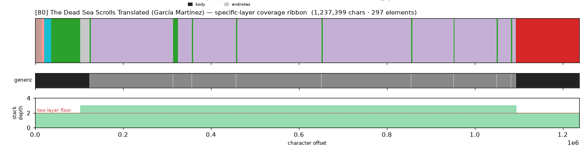
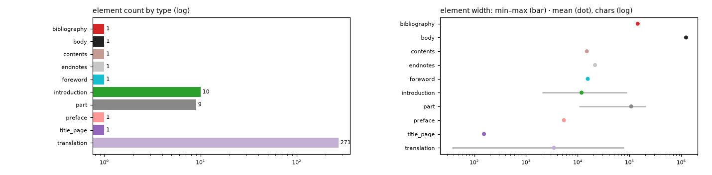

# Masking-Map Audit — [80] The Dead Sea Scrolls Translated (García Martínez)

- **Source file:** `The Dead Sea scrolls translated _ the Qumran texts in -- [edited by] Florentino García Martínez; Wilfred G_E_ -- 2011 -- William B_ Eerdmans -- isbn13 9780802841933 -- d376ed7413b2c8079b55a16507a08979 -- Anna’s Archive.epub`
- **Text length:** 1,237,399 chars
- **Mask elements (complete map):** 297
- **Distinct mask types:** 10 (2 generic, 8 specific)
- **Status:** ✅ COMPLETE — 100% two-layer, 0 sparse regions

## What this audits

The **gold's own intended masking map** — every mask element typed by close reading with exact, materialized per-instance boundaries (NOT the production detector's output). **Generic** = `body, volume, book, part` (broad containers). **Specific** = the other 30 types, including `chapter`. **Gate:** every character carries ≥1 generic AND ≥1 specific mask; `body[0,EOF]` is the universal generic base, so the specific layer must tile 100%.

## Coverage summary

| Class | Chars | % of text |
|---|---:|---:|
| ✅ covered (≥1 generic + ≥1 specific) | 1,237,399 | 100.00% |
| generic-only | 0 | 0.00% |
| specific-only | 0 | 0.00% |
| uncovered | 0 | 0.00% |

**Two-layer coverage: 100.00%.** Sparse regions (generic-only or specific-only): **0** (0 chars).

## Masking-map layout (specific layer, linearized left→right)

```
lBsyyyyyypDDDDDDDDDDDDDDyDDyDDDDDDDDDDDDDDDDDDDDDDDDDDDDDDDDDDDDDDDDDDDDDDDDDDDDDDDDDggggggggggg
```
<sub>B=preface  D=translation  g=bibliography  l=contents  p=endnotes  s=foreword  y=introduction</sub>



*(Ribbon = innermost specific type per cell; the generic layer + mask-stack-depth profile — showing the ≥2 two-layer floor — are in the figure above.)*

## Mask-type breakdown (all 34 types, including 0-counts)

| type | layer | count | width min / median / max | total chars |
|---|---|---:|---:|---:|
| about_author | specific | 0  | — | — |
| acknowledgments | specific | 0  | — | — |
| addendum | specific | 0  | — | — |
| afterword | specific | 0  | — | — |
| appendix | specific | 0  | — | — |
| back_matter | specific | 0  | — | — |
| **bibliography** | specific | 1 | 144,032 / 144,032 / 144,032 | 144,032 |
| **body** | generic | 1 | 1,237,399 / 1,237,399 / 1,237,399 | 1,237,399 |
| book | generic | 0  | — | — |
| chapter | specific | 0  | — | — |
| chapter_heading | specific | 0  | — | — |
| colophon | specific | 0  | — | — |
| commentary | specific | 0  | — | — |
| **contents** | specific | 1 | 14,965 / 14,965 / 14,965 | 14,965 |
| copyright | specific | 0  | — | — |
| dedication | specific | 0  | — | — |
| discussion | specific | 0  | — | — |
| **endnotes** | specific | 1 | 21,556 / 21,556 / 21,556 | 21,556 |
| epigraph | specific | 0  | — | — |
| footnotes | specific | 0  | — | — |
| **foreword** | specific | 1 | 15,608 / 15,608 / 15,608 | 15,608 |
| front_matter | specific | 0  | — | — |
| glossary | specific | 0  | — | — |
| header | specific | 0  | — | — |
| index | specific | 0  | — | — |
| insert | specific | 0  | — | — |
| **introduction** | specific | 10 | 2,062 / 2,377 / 88,136 | 118,280 |
| letter | specific | 0  | — | — |
| **part** | generic | 9 | 10,631 / 97,985 / 204,277 | 969,093 |
| poetry | specific | 0  | — | — |
| **preface** | specific | 1 | 5,411 / 5,411 / 5,411 | 5,411 |
| **title_page** | specific | 1 | 154 / 154 / 154 | 154 |
| **translation** | specific | 271 | 37 / 1,406 / 78,494 | 938,949 |
| volume | generic | 0  | — | — |

## Per-instance edges & rules

| structure | role | count | materialization |
|---|---|---:|---|
| part | secondary | 9 | `regex_in_span`  |
| introduction | secondary | 9 | `—`  |
| translation | primary | 271 | `multi` ✏️ corrected |

**Count corrections this build:**

- `translation` → **271** — 270→271): Genesis Apocryphon (1Q20) is two distinct units (main scroll + Milik's fragments) per the back-matter MS list; 270 was the editor's round figure.

## Element-width distribution by type



---

<sub>Generated from the gold-intended masking map (`.scratch/mask-eval/masking_map.py`); detector not consulted. Coordinates character-exact from `reference_text()`. Part of the [unified audit portfolio](../portfolio/index.html).</sub>
