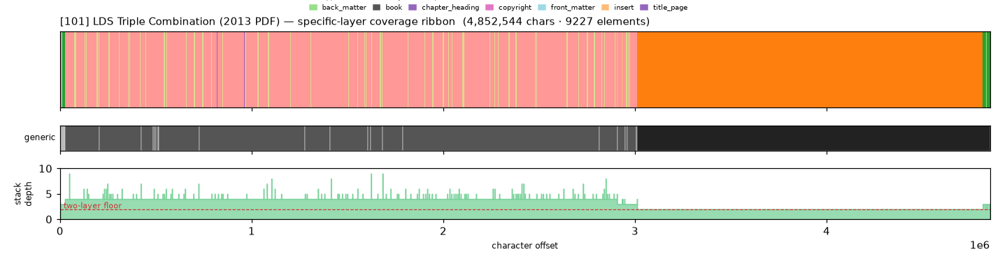
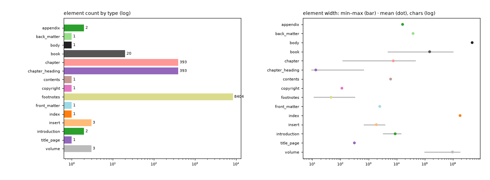

# Masking-Map Audit — [101] LDS Triple Combination (2013 PDF)

- **Source file:** `LDS_eng.pdf`
- **Text length:** 4,852,544 chars
- **Mask elements (complete map):** 9,227
- **Distinct mask types:** 15 (3 generic, 12 specific)
- **Status:** ✅ COMPLETE — 100% two-layer, 0 sparse regions

## What this audits

The **gold's own intended masking map** — every mask element typed by close reading with exact, materialized per-instance boundaries (NOT the production detector's output). **Generic** = `body, volume, book, part` (broad containers). **Specific** = the other 30 types, including `chapter`. **Gate:** every character carries ≥1 generic AND ≥1 specific mask; `body[0,EOF]` is the universal generic base, so the specific layer must tile 100%.

## Coverage summary

| Class | Chars | % of text |
|---|---:|---:|
| ✅ covered (≥1 generic + ≥1 specific) | 4,852,544 | 100.00% |
| generic-only | 0 | 0.00% |
| specific-only | 0 | 0.00% |
| uncovered | 0 | 0.00% |

**Two-layer coverage: 100.00%.** Sparse regions (generic-only or specific-only): **0** (0 chars).

## Masking-map layout (specific layer, linearized left→right)

```
yhhhhhhhhhhhhhhhhhhhhhhhhhhhhhhhhhhhhhhhhhhhhhhhhhhhhhhhhhhhwwwwwwwwwwwwwwwwwwwwwwwwwwwwwwwwwwwf
```
<sub>f=back_matter  h=chapter  w=index  y=introduction</sub>



*(Ribbon = innermost specific type per cell; the generic layer + mask-stack-depth profile — showing the ≥2 two-layer floor — are in the figure above.)*

## Mask-type breakdown (all 34 types, including 0-counts)

| type | layer | count | width min / median / max | total chars |
|---|---|---:|---:|---:|
| about_author | specific | 0  | — | — |
| acknowledgments | specific | 0  | — | — |
| addendum | specific | 0  | — | — |
| afterword | specific | 0  | — | — |
| **appendix** | specific | 2 | 16,156 / 16,275 / 16,395 | 32,551 |
| **back_matter** | specific | 1 | 38,374 / 38,374 / 38,374 | 38,374 |
| bibliography | specific | 0  | — | — |
| **body** | generic | 1 | 4,852,544 / 4,852,544 / 4,852,544 | 4,852,544 |
| **book** | generic | 20 | 4,716 / 63,188 / 1,028,434 | 2,985,268 |
| **chapter** | specific | 393 | 117 / 6,696 / 47,542 | 2,984,240 |
| **chapter_heading** | specific | 393 | 9 / 10 / 687 | 5,230 |
| colophon | specific | 0  | — | — |
| commentary | specific | 0  | — | — |
| **contents** | specific | 1 | 6,107 / 6,107 / 6,107 | 6,107 |
| **copyright** | specific | 1 | 113 / 113 / 113 | 113 |
| dedication | specific | 0  | — | — |
| discussion | specific | 0  | — | — |
| endnotes | specific | 0  | — | — |
| epigraph | specific | 0  | — | — |
| **footnotes** | specific | 8404 | 11 / 35 / 327 | 387,953 |
| foreword | specific | 0  | — | — |
| **front_matter** | specific | 1 | 2,508 / 2,508 / 2,508 | 2,508 |
| glossary | specific | 0  | — | — |
| header | specific | 0  | — | — |
| **index** | specific | 1 | 1,803,148 / 1,803,148 / 1,803,148 | 1,803,148 |
| **insert** | specific | 3 | 660 / 1,115 / 3,911 | 5,686 |
| **introduction** | specific | 2 | 3,165 / 8,870 / 14,575 | 17,740 |
| letter | specific | 0  | — | — |
| part | generic | 0  | — | — |
| poetry | specific | 0  | — | — |
| preface | specific | 0  | — | — |
| **title_page** | specific | 1 | 314 / 314 / 314 | 314 |
| translation | specific | 0  | — | — |
| **volume** | generic | 3 | 94,520 / 970,566 / 1,841,847 | 2,906,933 |

## Per-instance edges & rules

| structure | role | count | materialization |
|---|---|---:|---|
| volume | secondary | 3 | `regex_in_span`  |
| book | secondary | 20 | `regex_in_span`  |
| chapter | secondary | 393 | `regex_in_span`  |
| chapter_heading | primary | 393 | `regex_in_span`  |
| footnotes | secondary | None | `regex_in_span`  |
| insert | secondary | 3 | `—`  |

## Element-width distribution by type



---

<sub>Generated from the gold-intended masking map (`.scratch/mask-eval/masking_map.py`); detector not consulted. Coordinates character-exact from `reference_text()`. Part of the [unified audit portfolio](../portfolio/index.html).</sub>
