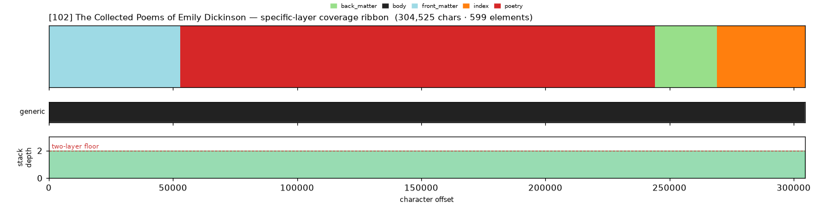
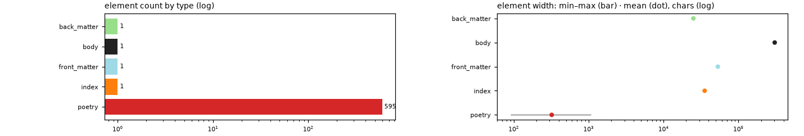

# Masking-Map Audit — [102] The Collected Poems of Emily Dickinson

- **Source file:** `The Collected Poems of Emily Dickinson (Barnes & Noble -- Dickinson, Emily; Wetzsteon, Rachel -- Barnes & Noble classics, New York, New York State, -- isbn13 9781593080501 -- a4d7cce7b4c5749f13a3b3e795969a32 -- Anna’s Archive.epub`
- **Text length:** 304,525 chars
- **Mask elements (complete map):** 599
- **Distinct mask types:** 5 (1 generic, 4 specific)
- **Status:** ✅ COMPLETE — 100% two-layer, 0 sparse regions

## What this audits

The **gold's own intended masking map** — every mask element typed by close reading with exact, materialized per-instance boundaries (NOT the production detector's output). **Generic** = `body, volume, book, part` (broad containers). **Specific** = the other 30 types, including `chapter`. **Gate:** every character carries ≥1 generic AND ≥1 specific mask; `body[0,EOF]` is the universal generic base, so the specific layer must tile 100%.

## Coverage summary

| Class | Chars | % of text |
|---|---:|---:|
| ✅ covered (≥1 generic + ≥1 specific) | 304,525 | 100.00% |
| generic-only | 0 | 0.00% |
| specific-only | 0 | 0.00% |
| uncovered | 0 | 0.00% |

**Two-layer coverage: 100.00%.** Sparse regions (generic-only or specific-only): **0** (0 chars).

## Masking-map layout (specific layer, linearized left→right)

```
tttttttttttttttttAAAAAAAAAAAAAAAAAAAAAAAAAAAAAAAAAAAAAAAAAAAAAAAAAAAAAAAAAAAAffffffffwwwwwwwwwww
```
<sub>A=poetry  f=back_matter  t=front_matter  w=index</sub>



*(Ribbon = innermost specific type per cell; the generic layer + mask-stack-depth profile — showing the ≥2 two-layer floor — are in the figure above.)*

## Mask-type breakdown (all 34 types, including 0-counts)

| type | layer | count | width min / median / max | total chars |
|---|---|---:|---:|---:|
| about_author | specific | 0  | — | — |
| acknowledgments | specific | 0  | — | — |
| addendum | specific | 0  | — | — |
| afterword | specific | 0  | — | — |
| appendix | specific | 0  | — | — |
| **back_matter** | specific | 1 | 24,974 / 24,974 / 24,974 | 24,974 |
| bibliography | specific | 0  | — | — |
| **body** | generic | 1 | 304,525 / 304,525 / 304,525 | 304,525 |
| book | generic | 0  | — | — |
| chapter | specific | 0  | — | — |
| chapter_heading | specific | 0  | — | — |
| colophon | specific | 0  | — | — |
| commentary | specific | 0  | — | — |
| contents | specific | 0  | — | — |
| copyright | specific | 0  | — | — |
| dedication | specific | 0  | — | — |
| discussion | specific | 0  | — | — |
| endnotes | specific | 0  | — | — |
| epigraph | specific | 0  | — | — |
| footnotes | specific | 0  | — | — |
| foreword | specific | 0  | — | — |
| **front_matter** | specific | 1 | 53,034 / 53,034 / 53,034 | 53,034 |
| glossary | specific | 0  | — | — |
| header | specific | 0  | — | — |
| **index** | specific | 1 | 35,355 / 35,355 / 35,355 | 35,355 |
| insert | specific | 0  | — | — |
| introduction | specific | 0  | — | — |
| letter | specific | 0  | — | — |
| part | generic | 0  | — | — |
| **poetry** | specific | 595 | 90 / 247 / 1,080 | 191,162 |
| preface | specific | 0  | — | — |
| title_page | specific | 0  | — | — |
| translation | specific | 0  | — | — |
| volume | generic | 0  | — | — |

## Per-instance edges & rules

| structure | role | count | materialization |
|---|---|---:|---|
| poetry | primary | 595 | `roman_in_span` ✏️ corrected |
| part | secondary | 5 | `—`  |

**Count corrections this build:**

- `poetry` → **595** — via the per-instance materializer (.scratch/mask-eval/instance_edges.py, count gate GREEN at 595): the prior 589 was a max-numeral estimate, but this B&N edition merges multiple source collections and numbers NON-MONOTONICALLY (e.g. PART FIVE runs …CXXX, CXXXXI=141, CXXXII=132…), so the count of distinct numbered headers (591) exceeds the highest numeral reached. Excluded: the 'FROM THE PAGES OF…' front-matter header and verses quoted in the INTRODUCTION. NOTE: a raw /^[IVXLC]+$/ count over the WHOLE text yields ~1187 — those are the front CONTENTS + back INDEX OF FIRST LINES re-listing the numerals, NOT body poems; the body-span filter isolates the 591 true headers (the earlier 'standalone I pronoun' explanation was wrong).

## Element-width distribution by type



---

<sub>Generated from the gold-intended masking map (`.scratch/mask-eval/masking_map.py`); detector not consulted. Coordinates character-exact from `reference_text()`. Part of the [unified audit portfolio](../portfolio/index.html).</sub>
