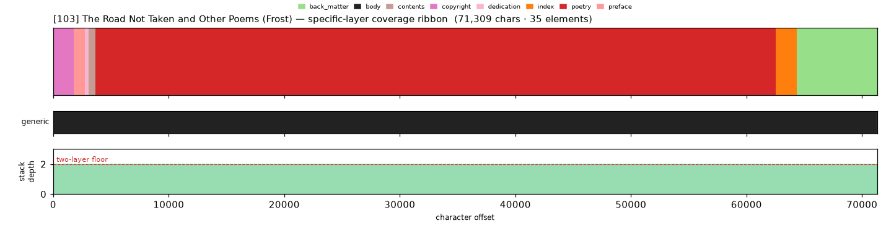
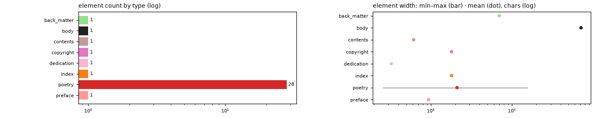

# Masking-Map Audit — [103] The Road Not Taken and Other Poems (Frost)

- **Source file:** `The Road Not Taken and Other Poems -- Frost, Robert -- 2012 -- Dover Publications -- isbn13 9780486111292 -- 9d94b2c221d6d795f99642712ed2d7d0 -- Anna’s Archive.epub`
- **Text length:** 71,309 chars
- **Mask elements (complete map):** 35
- **Distinct mask types:** 8 (1 generic, 7 specific)
- **Status:** ✅ COMPLETE — 100% two-layer, 0 sparse regions

## What this audits

The **gold's own intended masking map** — every mask element typed by close reading with exact, materialized per-instance boundaries (NOT the production detector's output). **Generic** = `body, volume, book, part` (broad containers). **Specific** = the other 30 types, including `chapter`. **Gate:** every character carries ≥1 generic AND ≥1 specific mask; `body[0,EOF]` is the universal generic base, so the specific layer must tile 100%.

## Coverage summary

| Class | Chars | % of text |
|---|---:|---:|
| ✅ covered (≥1 generic + ≥1 specific) | 71,309 | 100.00% |
| generic-only | 0 | 0.00% |
| specific-only | 0 | 0.00% |
| uncovered | 0 | 0.00% |

**Two-layer coverage: 100.00%.** Sparse regions (generic-only or specific-only): **0** (0 chars).

## Masking-map layout (specific layer, linearized left→right)

```
mmBBlAAAAAAAAAAAAAAAAAAAAAAAAAAAAAAAAAAAAAAAAAAAAAAAAAAAAAAAAAAAAAAAAAAAAAAAAAAAAAAAwwwfffffffff
```
<sub>A=poetry  B=preface  f=back_matter  l=contents  m=copyright  w=index</sub>



*(Ribbon = innermost specific type per cell; the generic layer + mask-stack-depth profile — showing the ≥2 two-layer floor — are in the figure above.)*

## Mask-type breakdown (all 34 types, including 0-counts)

| type | layer | count | width min / median / max | total chars |
|---|---|---:|---:|---:|
| about_author | specific | 0  | — | — |
| acknowledgments | specific | 0  | — | — |
| addendum | specific | 0  | — | — |
| afterword | specific | 0  | — | — |
| appendix | specific | 0  | — | — |
| **back_matter** | specific | 1 | 6,976 / 6,976 / 6,976 | 6,976 |
| bibliography | specific | 0  | — | — |
| **body** | generic | 1 | 71,309 / 71,309 / 71,309 | 71,309 |
| book | generic | 0  | — | — |
| chapter | specific | 0  | — | — |
| chapter_heading | specific | 0  | — | — |
| colophon | specific | 0  | — | — |
| commentary | specific | 0  | — | — |
| **contents** | specific | 1 | 613 / 613 / 613 | 613 |
| **copyright** | specific | 1 | 1,802 / 1,802 / 1,802 | 1,802 |
| **dedication** | specific | 1 | 326 / 326 / 326 | 326 |
| discussion | specific | 0  | — | — |
| endnotes | specific | 0  | — | — |
| epigraph | specific | 0  | — | — |
| footnotes | specific | 0  | — | — |
| foreword | specific | 0  | — | — |
| front_matter | specific | 0  | — | — |
| glossary | specific | 0  | — | — |
| header | specific | 0  | — | — |
| **index** | specific | 1 | 1,803 / 1,803 / 1,803 | 1,803 |
| insert | specific | 0  | — | — |
| introduction | specific | 0  | — | — |
| letter | specific | 0  | — | — |
| part | generic | 0  | — | — |
| **poetry** | specific | 28 | 255 / 996 / 15,789 | 58,853 |
| **preface** | specific | 1 | 936 / 936 / 936 | 936 |
| title_page | specific | 0  | — | — |
| translation | specific | 0  | — | — |
| volume | generic | 0  | — | — |

## Per-instance edges & rules

| structure | role | count | materialization |
|---|---|---:|---|
| poetry | primary | 28 | `title_list`  |

## Element-width distribution by type



---

<sub>Generated from the gold-intended masking map (`.scratch/mask-eval/masking_map.py`); detector not consulted. Coordinates character-exact from `reference_text()`. Part of the [unified audit portfolio](../portfolio/index.html).</sub>
