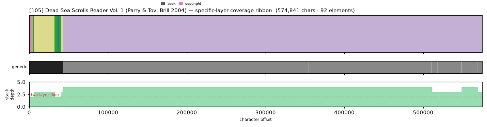
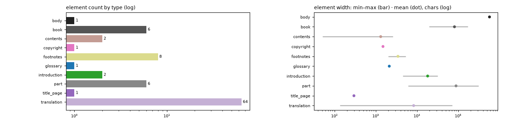

# Masking-Map Audit — [105] Dead Sea Scrolls Reader Vol. 1 (Parry & Tov, Brill 2004)

- **Source file:** `The Dead Sea Scrolls Reader, Vol_ 1_ Texts Concerned With -- edited by Donald W_ Parry & Emanuel Tov with the assistance -- 1, 2004 -- Brill Academic -- isbn13 9781423712275 -- 79bba3ff81b9b5adf8d401cdd0f7d237 -- Anna’s Archive.pdf`
- **Text length:** 574,841 chars
- **Mask elements (complete map):** 92
- **Distinct mask types:** 10 (3 generic, 7 specific)
- **Status:** ✅ COMPLETE — 100% two-layer, 0 sparse regions

## What this audits

The **gold's own intended masking map** — every mask element typed by close reading with exact, materialized per-instance boundaries (NOT the production detector's output). **Generic** = `body, volume, book, part` (broad containers). **Specific** = the other 30 types, including `chapter`. **Gate:** every character carries ≥1 generic AND ≥1 specific mask; `body[0,EOF]` is the universal generic base, so the specific layer must tile 100%.

## Coverage summary

| Class | Chars | % of text |
|---|---:|---:|
| ✅ covered (≥1 generic + ≥1 specific) | 574,841 | 100.00% |
| generic-only | 0 | 0.00% |
| specific-only | 0 | 0.00% |
| uncovered | 0 | 0.00% |

**Two-layer coverage: 100.00%.** Sparse regions (generic-only or specific-only): **0** (0 chars).

## Masking-map layout (specific layer, linearized left→right)

```
lyyyyyyDDDDDDDDDDDDDDDDDDDDDDDDDDDDDDDDDDDDDDDDDDDDDDDDDDDDDDDDDDDDDDDDDDDDDDDDDDDDDDDDDDDDDDDDD
```
<sub>D=translation  l=contents  y=introduction</sub>



*(Ribbon = innermost specific type per cell; the generic layer + mask-stack-depth profile — showing the ≥2 two-layer floor — are in the figure above.)*

## Mask-type breakdown (all 34 types, including 0-counts)

| type | layer | count | width min / median / max | total chars |
|---|---|---:|---:|---:|
| about_author | specific | 0  | — | — |
| acknowledgments | specific | 0  | — | — |
| addendum | specific | 0  | — | — |
| afterword | specific | 0  | — | — |
| appendix | specific | 0  | — | — |
| back_matter | specific | 0  | — | — |
| bibliography | specific | 0  | — | — |
| **body** | generic | 1 | 574,841 / 574,841 / 574,841 | 574,841 |
| **book** | generic | 6 | 19,837 / 69,795 / 172,406 | 487,800 |
| chapter | specific | 0  | — | — |
| chapter_heading | specific | 0  | — | — |
| colophon | specific | 0  | — | — |
| commentary | specific | 0  | — | — |
| **contents** | specific | 2 | 51 / 1,321 / 2,591 | 2,642 |
| **copyright** | specific | 1 | 1,499 / 1,499 / 1,499 | 1,499 |
| dedication | specific | 0  | — | — |
| discussion | specific | 0  | — | — |
| endnotes | specific | 0  | — | — |
| epigraph | specific | 0  | — | — |
| **footnotes** | specific | 8 | 2,018 / 3,215 / 5,287 | 27,683 |
| foreword | specific | 0  | — | — |
| front_matter | specific | 0  | — | — |
| **glossary** | specific | 1 | 2,132 / 2,132 / 2,132 | 2,132 |
| header | specific | 0  | — | — |
| index | specific | 0  | — | — |
| insert | specific | 0  | — | — |
| **introduction** | specific | 2 | 4,582 / 18,161 / 31,740 | 36,322 |
| letter | specific | 0  | — | — |
| **part** | generic | 6 | 6,141 / 25,363 / 312,019 | 531,950 |
| poetry | specific | 0  | — | — |
| preface | specific | 0  | — | — |
| **title_page** | specific | 1 | 296 / 296 / 296 | 296 |
| **translation** | specific | 64 | 136 / 3,254 / 71,698 | 531,950 |
| volume | generic | 0  | — | — |

## Per-instance edges & rules

| structure | role | count | materialization |
|---|---|---:|---|
| part | secondary | 6 | `title_list`  |
| book | secondary | 6 | `—`  |
| translation | primary | 63 | `regex_in_span`  |

## Element-width distribution by type



---

<sub>Generated from the gold-intended masking map (`.scratch/mask-eval/masking_map.py`); detector not consulted. Coordinates character-exact from `reference_text()`. Part of the [unified audit portfolio](../portfolio/index.html).</sub>
