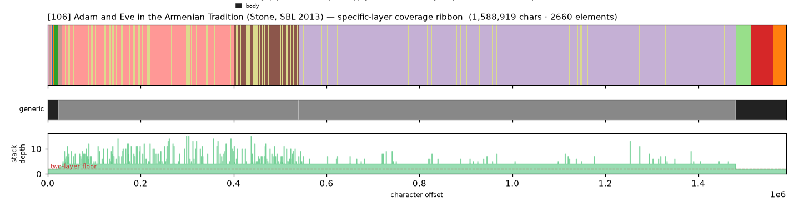
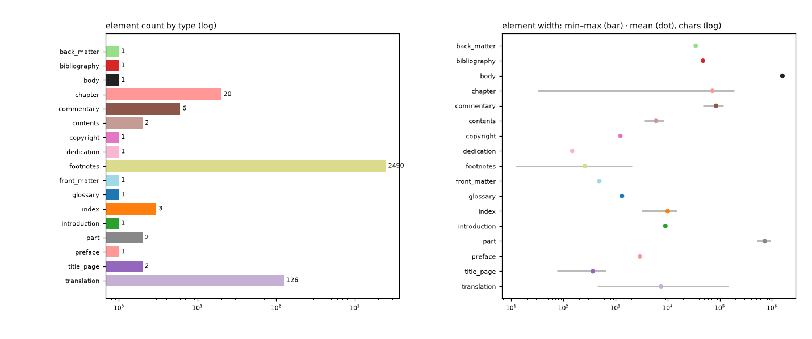

# Masking-Map Audit — [106] Adam and Eve in the Armenian Tradition (Stone, SBL 2013)

- **Source file:** `Adam And Eve In The Armenian Tradition, Fifth Through -- Michael E_ Stone -- SBL Early Judaism and Its Literature, 38, 2013 -- Society of Biblical -- isbn13 9781589838987 -- b3740d792550531690234343f398e9b7 -- Anna’s Archive.pdf`
- **Text length:** 1,588,919 chars
- **Mask elements (complete map):** 2,660
- **Distinct mask types:** 17 (2 generic, 15 specific)
- **Status:** ✅ COMPLETE — 100% two-layer, 0 sparse regions

## What this audits

The **gold's own intended masking map** — every mask element typed by close reading with exact, materialized per-instance boundaries (NOT the production detector's output). **Generic** = `body, volume, book, part` (broad containers). **Specific** = the other 30 types, including `chapter`. **Gate:** every character carries ≥1 generic AND ≥1 specific mask; `body[0,EOF]` is the universal generic base, so the specific layer must tile 100%.

## Coverage summary

| Class | Chars | % of text |
|---|---:|---:|
| ✅ covered (≥1 generic + ≥1 specific) | 1,588,919 | 100.00% |
| generic-only | 0 | 0.00% |
| specific-only | 0 | 0.00% |
| uncovered | 0 | 0.00% |

**Two-layer coverage: 100.00%.** Sparse regions (generic-only or specific-only): **0** (0 chars).

## Masking-map layout (specific layer, linearized left→right)

```
llkkkkkkkkkkkkkkkkkkkkkkkkkhkkkkkhhhhhhhhhhhhhhhhhhhhhhhhhhhhhhhhhhhhhhhhhhhhhhhhhhhDhhhhfffggww
```
<sub>D=translation  f=back_matter  g=bibliography  h=chapter  k=commentary  l=contents  w=index</sub>



*(Ribbon = innermost specific type per cell; the generic layer + mask-stack-depth profile — showing the ≥2 two-layer floor — are in the figure above.)*

## Mask-type breakdown (all 34 types, including 0-counts)

| type | layer | count | width min / median / max | total chars |
|---|---|---:|---:|---:|
| about_author | specific | 0  | — | — |
| acknowledgments | specific | 0  | — | — |
| addendum | specific | 0  | — | — |
| afterword | specific | 0  | — | — |
| appendix | specific | 0  | — | — |
| **back_matter** | specific | 1 | 34,541 / 34,541 / 34,541 | 34,541 |
| **bibliography** | specific | 1 | 47,470 / 47,470 / 47,470 | 47,470 |
| **body** | generic | 1 | 1,588,919 / 1,588,919 / 1,588,919 | 1,588,919 |
| book | generic | 0  | — | — |
| **chapter** | specific | 20 | 32 / 70,467 / 189,911 | 1,448,958 |
| chapter_heading | specific | 0  | — | — |
| colophon | specific | 0  | — | — |
| **commentary** | specific | 6 | 46,999 / 81,836 / 117,914 | 508,961 |
| **contents** | specific | 2 | 3,624 / 5,974 / 8,324 | 11,948 |
| **copyright** | specific | 1 | 1,238 / 1,238 / 1,238 | 1,238 |
| **dedication** | specific | 1 | 147 / 147 / 147 | 147 |
| discussion | specific | 0  | — | — |
| endnotes | specific | 0  | — | — |
| epigraph | specific | 0  | — | — |
| **footnotes** | specific | 2490 | 12 / 173 / 2,060 | 642,887 |
| foreword | specific | 0  | — | — |
| **front_matter** | specific | 1 | 488 / 488 / 488 | 488 |
| **glossary** | specific | 1 | 1,330 / 1,330 / 1,330 | 1,330 |
| header | specific | 0  | — | — |
| **index** | specific | 3 | 3,158 / 11,804 / 15,130 | 30,092 |
| insert | specific | 0  | — | — |
| **introduction** | specific | 1 | 9,043 / 9,043 / 9,043 | 9,043 |
| letter | specific | 0  | — | — |
| **part** | generic | 2 | 517,285 / 728,641 / 939,997 | 1,457,282 |
| poetry | specific | 0  | — | — |
| **preface** | specific | 1 | 2,930 / 2,930 / 2,930 | 2,930 |
| **title_page** | specific | 2 | 75 / 367 / 659 | 734 |
| **translation** | specific | 126 | 453 / 2,668 / 148,445 | 939,945 |
| volume | generic | 0  | — | — |

## Per-instance edges & rules

| structure | role | count | materialization |
|---|---|---:|---|
| translation | primary | 126 | `regex_in_span` ✏️ corrected |
| commentary | primary | 6 | `regex_in_span`  |
| part | secondary | 2 | `regex_in_span`  |
| chapter | secondary | 5 | `multi`  |
| chapter | secondary | 14 | `multi`  |
| footnotes | secondary | None | `regex_in_span`  |

**Count corrections this build:**

- `translation` → **126** — 121→126): 126 body source-entry units (author-header lines) vs 121 distinct authors in the front index.

## Element-width distribution by type



---

<sub>Generated from the gold-intended masking map (`.scratch/mask-eval/masking_map.py`); detector not consulted. Coordinates character-exact from `reference_text()`. Part of the [unified audit portfolio](../portfolio/index.html).</sub>
