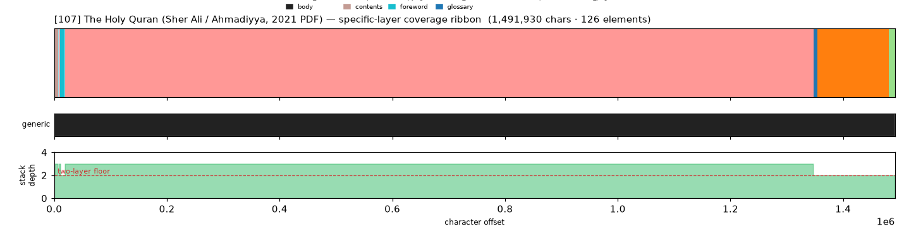
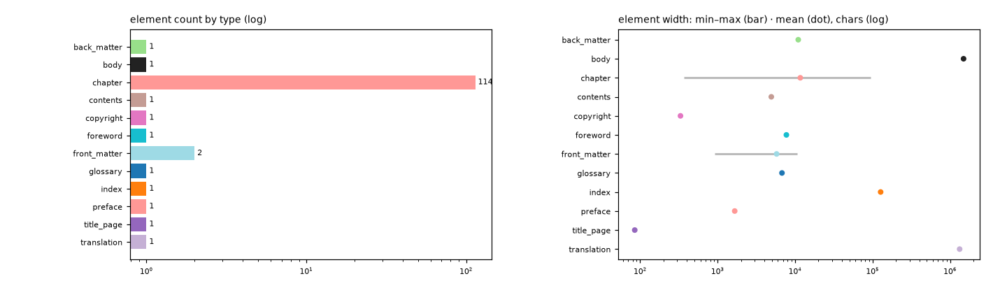

# Masking-Map Audit — [107] The Holy Quran (Sher Ali / Ahmadiyya, 2021 PDF)

- **Source file:** `The Holy Quran With Arabic Text And English Translation -- Maulawī Sher ʻAlī; Tahir Ahmad -- 2021 -- Islam International Publications Limited -- isbn13 9781848800229 -- 45d547fdc78588e53a0fc7b3166a36b4 -- Anna’s Archive.pdf`
- **Text length:** 1,491,930 chars
- **Mask elements (complete map):** 126
- **Distinct mask types:** 12 (1 generic, 11 specific)
- **Status:** ✅ COMPLETE — 100% two-layer, 0 sparse regions

## What this audits

The **gold's own intended masking map** — every mask element typed by close reading with exact, materialized per-instance boundaries (NOT the production detector's output). **Generic** = `body, volume, book, part` (broad containers). **Specific** = the other 30 types, including `chapter`. **Gate:** every character carries ≥1 generic AND ≥1 specific mask; `body[0,EOF]` is the universal generic base, so the specific layer must tile 100%.

## Coverage summary

| Class | Chars | % of text |
|---|---:|---:|
| ✅ covered (≥1 generic + ≥1 specific) | 1,491,930 | 100.00% |
| generic-only | 0 | 0.00% |
| specific-only | 0 | 0.00% |
| uncovered | 0 | 0.00% |

**Two-layer coverage: 100.00%.** Sparse regions (generic-only or specific-only): **0** (0 chars).

## Masking-map layout (specific layer, linearized left→right)

```
tDDDDDDDDDDDDDDDDDDDDDDDDDDDDDDDDDDDDDDDDDDDDDDDDDDDDDDDDDDDDDDDDDDDDDDDDDDDDDDDDDDDDDDwwwwwwwwf
```
<sub>D=translation  f=back_matter  t=front_matter  w=index</sub>



*(Ribbon = innermost specific type per cell; the generic layer + mask-stack-depth profile — showing the ≥2 two-layer floor — are in the figure above.)*

## Mask-type breakdown (all 34 types, including 0-counts)

| type | layer | count | width min / median / max | total chars |
|---|---|---:|---:|---:|
| about_author | specific | 0  | — | — |
| acknowledgments | specific | 0  | — | — |
| addendum | specific | 0  | — | — |
| afterword | specific | 0  | — | — |
| appendix | specific | 0  | — | — |
| **back_matter** | specific | 1 | 10,964 / 10,964 / 10,964 | 10,964 |
| bibliography | specific | 0  | — | — |
| **body** | generic | 1 | 1,491,930 / 1,491,930 / 1,491,930 | 1,491,930 |
| book | generic | 0  | — | — |
| **chapter** | specific | 114 | 369 / 5,833 / 93,599 | 1,328,090 |
| chapter_heading | specific | 0  | — | — |
| colophon | specific | 0  | — | — |
| commentary | specific | 0  | — | — |
| **contents** | specific | 1 | 4,923 / 4,923 / 4,923 | 4,923 |
| **copyright** | specific | 1 | 331 / 331 / 331 | 331 |
| dedication | specific | 0  | — | — |
| discussion | specific | 0  | — | — |
| endnotes | specific | 0  | — | — |
| epigraph | specific | 0  | — | — |
| footnotes | specific | 0  | — | — |
| **foreword** | specific | 1 | 7,707 / 7,707 / 7,707 | 7,707 |
| **front_matter** | specific | 2 | 915 / 5,763 / 10,611 | 11,526 |
| **glossary** | specific | 1 | 6,757 / 6,757 / 6,757 | 6,757 |
| header | specific | 0  | — | — |
| **index** | specific | 1 | 126,886 / 126,886 / 126,886 | 126,886 |
| insert | specific | 0  | — | — |
| introduction | specific | 0  | — | — |
| letter | specific | 0  | — | — |
| part | generic | 0  | — | — |
| poetry | specific | 0  | — | — |
| **preface** | specific | 1 | 1,659 / 1,659 / 1,659 | 1,659 |
| **title_page** | specific | 1 | 85 / 85 / 85 | 85 |
| **translation** | specific | 1 | 1,327,521 / 1,327,521 / 1,327,521 | 1,327,521 |
| volume | generic | 0  | — | — |

## Per-instance edges & rules

| structure | role | count | materialization |
|---|---|---:|---|
| chapter | primary | 114 | `regex_in_span`  |
| part | secondary | 30 | `—`  |
| commentary | secondary | None | `—`  |

## Element-width distribution by type



---

<sub>Generated from the gold-intended masking map (`.scratch/mask-eval/masking_map.py`); detector not consulted. Coordinates character-exact from `reference_text()`. Part of the [unified audit portfolio](../portfolio/index.html).</sub>
