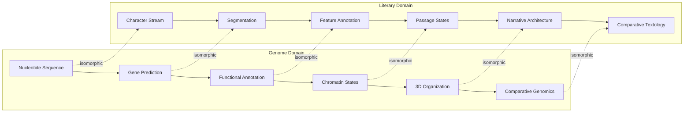
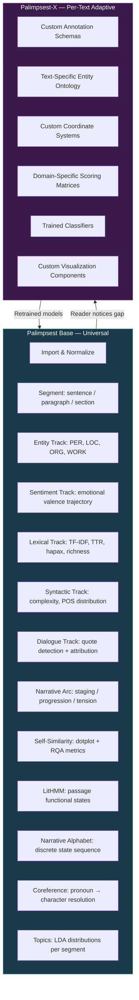
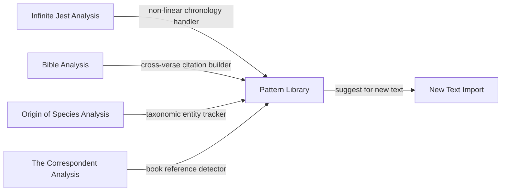
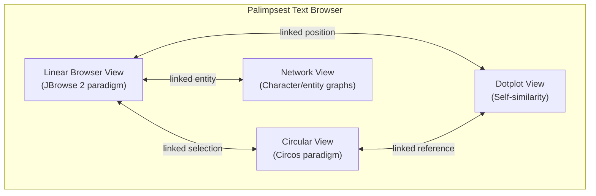

# Palimpsest: Vision Document

## The Genome Browser for Literature

**Date**: 2026-06-08 (v2.0); 2026-06-10 (note: Roadmap v4.0 adds 3 new principles not in this document)
**Version**: 2.0
**Status**: Stage 3a deliverable — consolidates docs 00, 01, 11, 19. Current roadmap is v4.0 (doc 28).
**Reviewed by**: Dr. Elena Marchetti (genomics), Prof. Sarah Blackwood (CL/comparative literature)

> **NOTE (2026-06-10)**: Roadmap v4.0 (doc 28) adds three design principles not present in this vision document: (8) "UI is the product surface" — every analysis capability must be accessible through the browser UI; (9) "Tooltips and feedback everywhere"; (10) "Genome browser, not document viewer" — follows UCSC/IGV/JBrowse 2 paradigms. These principles emerged from a design review comparing Palimpsest's UI against 8 genome browser platforms. The vision document's architectural description remains valid; the UI ambition has expanded significantly.

---

## Executive Summary

Palimpsest is a computational literary analysis platform built on the architectural principles of genome annotation and visualization. It treats text as sequence, analysis as annotation, comparison as alignment, and the genome browser as interaction paradigm. The platform computes universal analytical tracks automatically (Base), then adapts to each text through human-AI collaboration (X). Over time, it accumulates a library of analytical capabilities that transfer across texts — making each analysis a new layer of the platform's own palimpsest.

The project's intellectual foundations span four domains: computational linguistics (118 years from Harris 1954 to StoryRibbons 2025), genomics (56 years from Needleman-Wunsch 1970 to RepeatModeler2 2020), visualization theory (59 years from Bertin 1967 to JBrowse 2 2023), and narratology (60 years from Kristeva 1966 to Genette's enduring influence). This vision document synthesizes these foundations into a unified platform design.

---

## 1. The Name Is the Architecture

A palimpsest is a manuscript scraped clean and rewritten — but the earlier layers remain faintly visible beneath. The name encodes three simultaneous meanings:

1. **The object of study**: Literary texts are palimpsests. Every work carries traces of its sources, genre conventions, cultural context, revision history, and structural architecture — layers that computational analysis can reveal (Genette 1982/1997, *Palimpsests: Literature in the Second Degree*; Kristeva 1966 on intertextuality).

2. **The analytical method**: Palimpsest the platform uncovers hidden structure by layering multiple computational analyses atop the same text — NER, sentiment, topic models, structural segmentation, intertextual reference maps — each layer revealing something the others cannot. This is the ENCODE model (2012): 80.4% of the genome shows biochemical function when examined through enough orthogonal analytical lenses.

3. **The platform itself**: Palimpsest rewrites and evolves itself for each new text. The *Infinite Jest* version has different annotation schemas, different custom tracks, different trained models than the Bible version or the *Origin of Species* version. Each text's analysis becomes a new layer of the platform's accumulated intelligence.

---

## 2. The Isomorphism: Text as Genome

### 2.1 The Structural Correspondence



The correspondence is not metaphorical but structural. Both domains face identical computational problems:

| Problem | Genomics Solution | Palimpsest Solution |
|---------|-------------------|---------------------|
| Coordinate systems | Base-pair positions, genetic map distance, cytogenetic bands | Character offsets, narrative order, chronological order, page numbers[^1] |
| Feature discovery | Ab initio gene prediction (GENSCAN — Burge & Karlin 1997) | Unsupervised segmentation (TextTiling — Hearst 1997) |
| Evidence integration | MAKER pipeline: ab initio + transcript + homology | NarrativeMAKER: ML + textual evidence + cross-text parallels |
| State assignment | ChromHMM (Ernst & Kellis 2012): 15 chromatin states from histone marks | LitHMM: passage functional states from textual feature vectors |
| Long-range interactions | Hi-C contact maps (Lieberman-Aiden et al. 2009) | TextHiC: passage-pair similarity matrices |
| Comparative analysis | Whole-genome alignment (MUMmer — Kurtz et al. 2004) | Text alignment (GNAT — Pial & Skiena 2023) |
| Controlled vocabulary | Sequence Ontology (Eilbeck et al. 2005): 2,500+ terms | Literary Feature Ontology (LFO): to be developed |
| Multi-track browser | JBrowse 2 (Diesh et al. 2023), IGV (Robinson et al. 2011) | Palimpsest Text Browser (PTB) |
| Circular visualization | Circos (Krzywinski et al. 2009) | TextCircos: intertextual reference arcs |

[^1]: Genette (1972/1983) formalized the distinction between *récit* (narrative order) and *histoire* (chronological order) as the foundation of narratological analysis. Swinehart's Infinite Digest implements this as `pos` vs. `seq` columns in his datasets.

### 2.2 Where the Analogy Breaks — And Why That Matters

Prof. Blackwood would rightly insist: literature is not DNA. Three properties of literary texts have no genomic analogue, and Palimpsest's architecture must account for them:

1. **Intentionality**: A genome has no author; its "meaning" is functional consequence. A literary text has an author whose intentions (however inaccessible) constrain interpretation. Palimpsest addresses this through **perspectival modeling** (Underwood 2019): every analysis reflects a specific interpretive lens, never a single "truth."

2. **Ambiguity**: A codon has one amino acid translation (with minor exceptions). A literary passage supports multiple simultaneous valid readings. Palimpsest addresses this through **overlapping, multi-layer standoff annotation** (W3C Web Annotation Data Model; UIMA CAS): multiple annotations can occupy the same span without conflict.

3. **Aesthetic purpose**: A genome's "goal" is replication. A literary text's "goal" is aesthetic experience. Palimpsest addresses this through **phenomenological fidelity** (doc 17 §1.3): visualizations honor the reader's experience of the text rather than abstracting it away into a graph. Swinehart's work demonstrates this principle: his Infinite Digest designs make you *feel* the non-linear reading experience, not just see a data reduction of it.

---

## 3. The Base/X Architecture



### 3.1 Base: The Genome Sequence of Any Text

Base tracks are computed automatically on import, requiring no configuration, no human annotation, and no text-specific knowledge. They are the **raw data** from which all higher-level analyses derive.

Every Base track maps to a genomic analogue:

| Base Track | Source Algorithm | Genomic Analogue | Evidence Level |
|-----------|-----------------|-------------------|----------------|
| Segmentation | TextTiling (Hearst 1997) + SBERT discontinuity | Gene prediction (GENSCAN) | Ab initio |
| Entities | BookNLP (Bamman et al. 2014) / spaCy + LitBank | Gene annotation (Prokka) | Evidence-based |
| Sentiment | Sliding-window hedonometer (Reagan et al. 2016) | Expression level (RNA-seq) | Quantitative |
| Lexical | Corpus linguistics standard measures | GC content, repeat density | Quantitative |
| Syntactic | Dependency parsing (Nivre 2006) | Codon usage bias | Quantitative |
| Dialogue | BookNLP quote attribution | Promoter/regulatory element | Categorical |
| Narrative arc | Boyd 15-D function-word arc (2020) | Replication timing | Quantitative |
| Self-similarity | Church-Helfman dotplot (1993) + RQA | Self-alignment dotplot | Relational |
| LitHMM | Multivariate HMM (ChromHMM analogue) | Chromatin state (15 states) | Structural |
| Narrative alphabet | K-means on feature vectors → discrete labels | 3Di structural alphabet (Foldseek) | Structural |
| Coreference | BookNLP coreference chains | Gene family clustering | Relational |
| Topics | LDA (Blei et al. 2003) | GO term enrichment | Categorical |

### 3.2 X: The Adaptive Extension Layer

X features emerge from the interaction between a human reader and an AI assistant. The cycle (doc 11 §1.3):

```
Reader imports text
  → Base tracks compute automatically
  → Reader notices something Base doesn't capture
  → Reader describes the feature to an AI agent
  → Agent proposes: annotation schema + detection strategy + visualization
  → Reader refines and approves
  → Agent implements the custom track
  → Detection model improves as reader corrects false positives
  → New track becomes part of this text's X configuration
```

This is the MAKER evidence model applied to the platform: the AI provides ab initio predictions, the text provides structural evidence, the reader provides expert curation.

### 3.3 How X Transfers Across Texts

Over time, the platform accumulates a **library of analytical patterns**:



When a reader begins analyzing a new text, the platform offers: *"This looks like an epistolary novel. Would you like to import the letter-detection and book-reference schemas from your Correspondent project?"* This is annotation liftover — Liftoff (genomics) applied to literary analysis.

---

## 4. The Five Analytical Layers

### 4.1 Layer 1 — Surface Alignment

The foundation: Smith-Waterman local alignment with SBERT semantic scoring (Pial & Skiena 2023). Given two texts (or two editions of the same text), identify corresponding passages with statistical significance calibrated via Gumbel distribution.

**Extends to**: Translation alignment (Gale & Church 1993), paraphrase detection, plagiarism detection, edition comparison (Eve 2019), collation (CollateX — Dekker & Van Hulle 2015).

### 4.2 Layer 2 — Structural Fingerprinting

Fast pre-filters that characterize a text's overall structure: Boyd's 15-dimensional narrative arc vector, Reagan's 6-arc classification via SVD, RQA metrics (recurrence rate, determinism, laminarity). These ~20-dimensional signatures enable corpus-scale retrieval before expensive pairwise alignment.

### 4.3 Layer 3 — Character Networks

BookNLP extracts character entities with typed dependency vectors (agent verbs, patient verbs, possessive nouns, predicative adjectives — Bamman et al. 2014). Elson et al. (2010) build dialogue-based social networks. Lubars et al. (2018) showed that *Infinite Jest*'s non-chronological sequencing is structurally optimal: higher degree, shorter paths, fewer disconnected components than the chronological ordering.

### 4.4 Layer 4 — Event Structure

Chambers & Jurafsky (2008, 2009) learn narrative event chains and schemas from raw text. These persist across retellings even when surface language changes entirely — the deepest structural fingerprint available. Two texts implementing the same schema are related even if nothing else matches.

### 4.5 Layer 5 — Passage Functional States (LitHMM)

The crown jewel: a multivariate HMM trained on combinatorial textual feature patterns discovers functional passage states without pre-specifying categories. The 15-state chromatin model (active promoter, enhancer, transcribed, repressed, bivalent, heterochromatic, quiescent) maps to literary passage types:

| Chromatin State | Literary Passage State | Feature Signature |
|----------------|----------------------|-------------------|
| Active promoter | Theme introduction | High NE density, low dialogue, topic novelty |
| Strong enhancer | Amplification/echo | High similarity to distant passage, low local novelty |
| Active transcription | Core narrative | High dialogue ratio, character interaction, sequential flow |
| Weak transcription | Transitional | Medium everything, connecting tissue |
| Repressed | Background/suppressed | Low engagement metrics, formulaic language |
| Bivalent | Ambiguous/ironic | Contradictory signals — positive sentiment + negative content, or vice versa |
| Quiescent | Exposition/setup | Low action, high information density, few characters |

---

## 5. Visualization Architecture

### 5.1 The Four Views



**Linear Browser View**: Multi-track annotation display along the character-offset axis. Zoom-dependent rendering: at chapter level, show density barcodes; at paragraph level, show individual annotation spans; at sentence level, show full detail. Derived from JBrowse 2's adapter/track/display/renderer architecture.

**Circular View**: Circos-style visualization of long-range relationships. Ribbons connect passages with high TextHiC contact scores. Color encodes relationship type (cross-reference, thematic echo, character callback). Width encodes strength.

**Dotplot View**: Self-similarity matrix showing recurring patterns, adapted from Church & Helfman (1993). Diagonal runs = sequential repetition; off-diagonal clusters = thematic echoes; anti-diagonal = chiastic structure. Zoom into any region to see passage details.

**Network View**: Character/entity interaction graph with Louvain community detection, betweenness centrality sizing, and temporal evolution. Linked to the linear view: selecting a character in the network highlights all their appearances in the text.

### 5.2 Semantic Zooming

Following Furnas (1986) and genome browser practice, every view implements semantic zooming — the visual representation changes qualitatively with zoom level:

| Zoom Level | Linear View | Circular View |
|-----------|-------------|---------------|
| **Corpus** | Book spines with density sparklines | Full-corpus citation chord |
| **Work** | Chapter blocks with track overviews | Whole-text reference arcs |
| **Chapter** | Paragraph strips with track barcodes | Chapter-level arcs |
| **Paragraph** | Sentence-by-sentence with inline annotations | Paragraph-level arcs with labels |
| **Sentence** | Full annotation detail with tooltips | N/A (too granular for circular) |

### 5.3 Design Principles

From the research corpus:

1. **Phenomenological fidelity** (Swinehart — doc 17): Designs should honor the reader's experience, not just abstract it into data. An endnote arc diagram should *feel* like the experience of flipping between pages.

2. **Data-ink ratio** (Tufte 1983): Maximize the proportion of ink devoted to data. Eliminate chart junk, decorative elements, and redundant encoding.

3. **Multiple valid interpretations** (StoryRibbons — Yeh et al. 2025): Visualizations support exploration, not assertion. The question is not "did the NLP get it right?" but "does this reveal a pattern the scholar hadn't noticed?"

4. **Coordinated multiple views** (Roberts 2007): Every selection in one view propagates to all linked views. Brushing in the dotplot highlights in the linear view and the network graph simultaneously.

5. **Progressive disclosure** (Munzner 2014): Show overview first, zoom and filter, then details on demand. Don't overwhelm with 12 tracks at once — let users build up complexity.

---

## 6. Beyond Standard Fare: Novel Analytical Capabilities

Palimpsest goes beyond what any existing CL or DH platform offers:

### 6.1 Literary Orthology and Paralogy

Adapted from Fitch (1970) and Koonin (2005): texts can be **orthologous** (descended from a common ancestor through divergence — different translations of the Iliad) or **paralogous** (duplicated within a tradition and diverging in function — the Odyssey as a paralog of the Iliad). Alignment-based phylogenetic methods can reconstruct the evolutionary history of textual traditions.

### 6.2 TextHiC: Thematic Contact Maps

From Hi-C (Lieberman-Aiden et al. 2009): build passage-pair similarity matrices to reveal:
- **A/B compartments**: Active vs. latent thematic domains (first eigenvector decomposition)
- **TAD-like domains**: Self-interacting narrative units (directionality index + HMM — Dixon et al. 2012)
- **Narrative loops**: Statistically anomalous long-range connections (HiCCUPS algorithm — Rao et al. 2014)

### 6.3 NarrativeMAKER: Evidence-Integrated Annotation

Three evidence streams weighted by confidence:
1. Ab initio ML predictions
2. Textual structural evidence
3. Cross-text alignment-derived parallels

Every annotation carries an AED-equivalent score. Human curation is always the final authority.

### 6.4 LitHMM: Agnostic State Discovery

Multivariate HMM on 8-12 simultaneous textual feature tracks discovers latent passage states. Not topic modeling (which discovers *what* passages are about), but functional state assignment (which discovers *what role* passages play in the narrative architecture). The distinction mirrors the difference between gene expression (what a gene produces) and chromatin state (what regulatory context it operates in).

### 6.5 Narrative Alphabet Alignment

From Foldseek (van Kempen et al. 2023): encode each segment's multi-dimensional feature vector as a discrete state label (the narrative alphabet), then align texts by their state sequences. This enables:
- Fast corpus-scale structural search (find all texts with the same "shape")
- Cross-language comparison (structure is language-independent)
- Genre clustering by structural similarity rather than content
- Detection of structural borrowing invisible to surface-level comparison

### 6.6 The Self-Rewriting Platform

Each Palimpsest-X analysis accumulates: trained models, custom schemas, entity registries, detection rules, visualization configurations. This is the platform's own palimpsest layer — intelligence written atop the Base by the interaction of reader and AI. The literary equivalent of the progressive refinement of genome annotations over decades of community effort (Gene Ontology Consortium 2000 → ENCODE 2012 → Roadmap 2015).

---

## 7. Target Texts and Use Cases

### 7.1 Primary Validation Text: *Infinite Jest*

David Foster Wallace's 1,079-page novel with 388 endnotes, non-chronological narrative order, 200+ named characters, and deep structural complexity. Swinehart's datasets provide ground truth. Lubars et al.'s (2018) network analysis provides validation benchmarks. Burn (2012) and Carlisle (2007) provide scholarly reference annotations.

**Why IJ**: It breaks every simplistic NLP assumption — non-linear time, unreliable narration, endnote networks, multiple intersecting plot threads, genre-mixing, and extreme vocabulary. If Palimpsest works on IJ, it works on anything.

### 7.2 Secondary Texts

| Text | Why | What It Tests |
|------|-----|---------------|
| **Bible (KJV + modern translations)** | Verse-level granularity, massive cross-reference network, multi-translation alignment | Scale, alignment, citation networks |
| **The Correspondent** (epistolary novel) | Letters as structural units, embedded book references, multiple narrators | X-schema creation, intertextual detection |
| **Origin of Species** (Darwin) | Argument structure, evidence citation, taxonomic hierarchy | Non-narrative text, scientific discourse |
| **Ulysses** (Joyce) | Stream of consciousness, Dublin geography, Homeric parallels | Extreme stylistic variation, geographic annotation |
| **Cloud Atlas** (Mitchell) | 6 nested narratives, inter-story echoes, genre shifts | Edition comparison (Eve 2019), structural nesting |

---

## 8. The Long-Term Vision

### 8.1 The Literary Genome Project

Just as the Human Genome Project sequenced one reference genome, then ENCODE annotated its functional elements, then the 1000 Genomes Project characterized human variation — Palimpsest enables a **Literary Genome Project**:

1. **Phase 1**: Build the platform and validate on single texts (IJ, Bible)
2. **Phase 2**: Annotate canonical works across traditions (English novel, Russian novel, Classical Greek, Chinese classical)
3. **Phase 3**: Comparative analysis at corpus scale — discover structural universals across languages and periods
4. **Phase 4**: Community annotation — scholars contribute X-schemas that become shared resources
5. **Phase 5**: The literary pangenome — a graph-based representation of all textual variation (Pan-Genomics Consortium 2018 analog)

### 8.2 What Success Looks Like

A scholar sits down with a new text. Within minutes, Palimpsest has computed 12 Base tracks. The scholar notices something — a recurring syntactic pattern the tracks don't capture. They describe it to the AI assistant. Within an hour, they have a custom track detecting it across the full text, a visualization showing its distribution, and alignment results showing where other texts in the corpus exhibit the same pattern. They publish a paper with the analysis embedded as a shareable Palimpsest project that other scholars can load, interrogate, extend, and critique.

This is what "the genome browser for literature" means: not a single tool, but a platform that makes computational literary analysis as natural, as rigorous, and as collaborative as modern genomics.

---

## Endnotes

**On the genomic analogy's limits**: Dr. Marchetti would note that genome annotation has ground truth (an organism either makes a protein or it doesn't), while literary annotation does not. This is correct and load-bearing. Palimpsest addresses it through perspectival modeling (Underwood 2019), confidence scoring (MAKER AED analog), and the principle that the platform supports exploration, not assertion.

**On computational methods and literary complexity**: Prof. Blackwood would note that reducing a novel to feature vectors risks losing what makes it literature. This is also correct. Palimpsest's response is the Base/X architecture: Base tracks are deliberately reductive — they capture what machines can capture. X is where the human reader brings interpretive judgment, domain expertise, and aesthetic sensitivity. The platform's value is not in the reduction but in making the reduction visible so the reader can respond to it.

**On scalability**: Dr. Okonkwo would note that computing 12 Base tracks on a 300-page novel involves substantial computation. The architecture addresses this through: Rust for CPU-intensive text processing, web workers for rendering, progressive computation (show early tracks while later ones compute), and caching of computed tracks so they never recompute.

**On visual clarity**: Dr. Patel would note that 12 simultaneous tracks overwhelm the user. The design addresses this through progressive disclosure (Munzner 2014): import shows only 3 default tracks; users add more as they explore. Semantic zooming ensures detail matches the user's current focus level.

**On real-world demands**: Alex Chen would load War and Peace, enable all 12 tracks, compare it side-by-side with Anna Karenina, and ask why the dotplot takes 8 seconds. This is exactly why performance architecture (doc 15) specifies tiled rendering, virtual scrolling, and background computation with progressive display.
