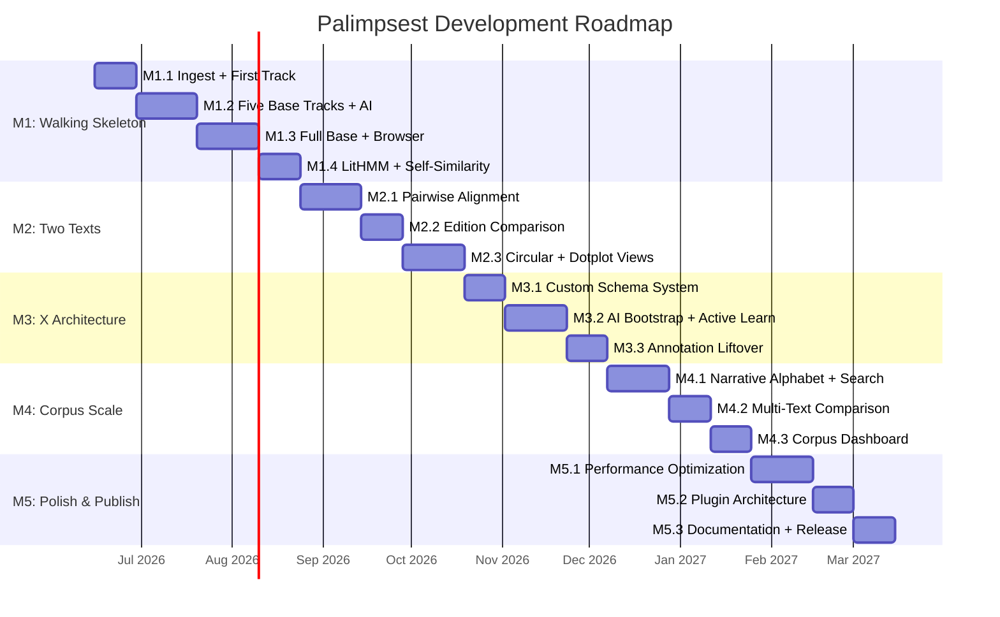

# Palimpsest Development Roadmap v3.0

**Date**: 2026-06-08
**Status**: SUPERSEDED by Roadmap v4.0 (doc 28) as of 2026-06-10
**Supersedes**: Roadmap v2.0 (doc 12)
**Superseded by**: Roadmap v4.0 (doc 28)
**Reviewed by**: Dr. Okonkwo (architecture), Dr. Patel (visualization), Alex Chen (stress testing)

> **NOTE**: v4.0 adds M1.5 (Browser Foundation Sprint) and inserts M2 (Interactive Workbench). All milestone numbers shift: v3.0 M2 = v4.0 M3; v3.0 M3 = v4.0 M4; v3.0 M4 = v4.0 M5; v3.0 M5 = v4.0 M6. M1.1-M1.4 are COMPLETE as of 2026-06-09.

---

## Principles

1. **Vertical slices, not horizontal layers.** Every milestone delivers a demonstrable capability.
2. **One text first, two texts second, many texts last.**
3. **The AI assistant is the product.** LLM integration from Milestone 1.
4. **X emerges from Base; never build X into Base.**
5. **Test against ground truth from Day 1.** Swinehart IJ datasets are validation benchmarks.
6. **Degrade gracefully.** Every component has a fallback path.
7. **Vision-gated milestones.** A milestone passes when the *demonstrated capability* matches the vision, not when the code compiles.

---

## Milestone Overview

---

## Milestone 1: Walking Skeleton (8-10 weeks)

**Vision gate**: Import a text, see 12 computed tracks in an interactive browser, ask the AI assistant to explain what a LitHMM state means. The complete product loop at minimum fidelity.

### M1.1: Ingest + Normalize + First Track (2 weeks)
**PRD coverage**: F-IMP-001, F-IMP-002, F-IMP-003, F-TRK-001

**Deliverables**:
- `palimpsest ingest <file>` CLI (PDF/EPUB/TXT → normalized text + segments)
- Unicode NFC normalization, SHA-256 reference checksum
- Sentence/paragraph/section segmentation (spaCy + TextTiling)
- One Base track: entities (BookNLP / spaCy NER → PER, LOC, ORG)
- PAF format v0.1 defined by implementation (the code is the spec)
- LFO v0.1 defined by track output (~15 terms)
- Minimal browser: React app rendering text with entity highlights
- Project directory structure established

**Acceptance**: Ingest IJ Chapter 1 in <5 seconds. Entity track detects "Hal", "Arizona". Browser displays text with colored entity spans.

### M1.2: Five Base Tracks + AI Summary (3 weeks)
**PRD coverage**: F-TRK-002, F-TRK-003, F-TRK-004, F-TRK-005, F-TRK-011, F-AI-001

**Deliverables**:
- Sentiment trajectory (F-TRK-002)
- Lexical features (F-TRK-003)
- Syntactic complexity (F-TRK-004)
- Dialogue attribution (F-TRK-005)
- Topic distributions (F-TRK-011)
- Local LLM integration: passage summarization via Ollama
- Track toggle UI with sparkline overviews

**Acceptance**: Five tracks render simultaneously. AI generates per-chapter summaries. Track toggling is instantaneous.

### M1.3: Full Base Suite + Browser (3 weeks)
**PRD coverage**: F-TRK-006, F-TRK-010, F-IMP-004, F-BRW-001, F-BRW-006

**Deliverables**:
- Narrative arc track (F-TRK-006)
- Coreference chains (F-TRK-010)
- Multiple coordinate systems (F-IMP-004)
- Full linear browser with zoom levels (F-BRW-001, F-BRW-006)
- Semantic zooming: work → chapter → paragraph → sentence detail levels
- Track reordering, toggling, and configuration panel

**Acceptance**: 9 Base tracks render on full IJ. Smooth scroll at 60fps. Zoom from work overview to sentence detail. Coordinate system switching (narrative ↔ chronological) for IJ.

### M1.4: LitHMM + Self-Similarity (2 weeks)
**PRD coverage**: F-TRK-007, F-TRK-008, F-TRK-009, F-TRK-012

**Deliverables**:
- Self-similarity matrix (TextHiC) computation + basic dotplot (F-TRK-007)
- LitHMM passage state discovery (F-TRK-008)
- Narrative alphabet generation (F-TRK-009)
- Thematic compartments (A/B decomposition + TAD-like domains) (F-TRK-012)
- All 12 Base tracks complete

**Vision gate**: Load IJ, see 12 computed tracks including LitHMM states color-coded on the text. Ask the AI: "What does the green state mean?" AI responds with the feature distribution that defines it. This is the "aha" moment — the text reveals functional structure the reader didn't know was there.

---

## Milestone 2: Two Texts (5-6 weeks)

**Vision gate**: Align two texts. See where they're similar and where they diverge. View the comparison in both linear and circular layouts. The first comparative analysis.

### M2.1: Pairwise Text Alignment (3 weeks)
**PRD coverage**: F-ALN-001, F-ALN-002

**Deliverables**:
- Smith-Waterman alignment with SBERT scoring (GNAT methodology)
- Gumbel-calibrated significance testing
- Narrative alphabet alignment (Foldseek analog)
- Alignment output as PAF records
- Basic alignment visualization (side-by-side text with ribbons)

**Acceptance**: Align IJ Ch. 1 with a Swinehart chapter summary. Alignment identifies corresponding passages with p-values. Narrative alphabet alignment runs 100x faster than semantic alignment.

### M2.2: Edition Comparison (2 weeks)
**PRD coverage**: F-ALN-004

**Deliverables**:
- Character-level diff with paragraph-preserving alignment (CollateX methodology)
- Diff statistics: change density per chapter, insertion/deletion/substitution counts
- Diff visualization: color-coded changes inline

**Acceptance**: Load two versions of a text, see all differences highlighted. Statistics panel shows change distribution.

### M2.3: Circular + Dotplot Views (3 weeks)
**PRD coverage**: F-BRW-002, F-BRW-003, F-BRW-005

**Deliverables**:
- Circos/circular view for relationship visualization (F-BRW-002)
- Interactive dotplot view for self-similarity (F-BRW-003)
- Coordinated multiple views: selection propagation across all views (F-BRW-005)
- TextHiC heatmap in dotplot view

**Vision gate**: Load IJ, open the circular view, see endnote cross-references as arcs — a Palimpsest version of Swinehart's "All Those Footnotes." Click an arc → navigate to the passage pair in the linear view. This IS the genome browser for literature.

---

## Milestone 3: X Architecture (5-6 weeks)

**Vision gate**: Create a custom annotation track from scratch using natural language, see it bootstrapped by AI, correct 20 examples, watch precision improve. The self-rewriting platform in action.

### M3.1: Custom Schema System (2 weeks)
**PRD coverage**: F-EXT-001, F-FMT-001, F-FMT-002, F-FMT-003

**Deliverables**:
- Schema editor UI
- PAF format finalized (F-FMT-001)
- LFO v1.0 with ≥100 terms (F-FMT-002)
- W3C Web Annotation import/export (F-FMT-003)

### M3.2: AI Bootstrap + Active Learning (3 weeks)
**PRD coverage**: F-EXT-002, F-AI-002, F-AI-003, F-AI-004

**Deliverables**:
- AI schema proposal from natural language (F-AI-002)
- AI-bootstrapped annotation with confidence scores (F-EXT-002)
- Human review UI: accept/reject/correct workflow
- Active learning: retrain after corrections (F-AI-003)
- Perspectival modeling: every annotation tagged with its generating perspective (F-AI-004)

### M3.3: Annotation Liftover (2 weeks)
**PRD coverage**: F-EXT-003

**Deliverables**:
- Alignment-based annotation transfer between texts
- Confidence scoring for transferred annotations
- Transfer visualization showing which annotations mapped and which didn't

**Vision gate**: Create a custom "irony" annotation on IJ. Bootstrap with AI, correct 50 examples. F1 improves from 0.60 to 0.85. Then transfer the irony detector to *White Noise* via alignment — some transfer, some don't. The platform has learned from one text and applied it to another.

---

## Milestone 4: Corpus Scale (5-6 weeks)

**Vision gate**: Load 50 novels. Run narrative alphabet alignment across all 50. Discover structural clusters that don't correspond to genre labels. This is distant reading at its most powerful.

### M4.1: Narrative Alphabet + Corpus Search (3 weeks)
**PRD coverage**: F-ALN-002 (at scale), NFR-002

**Deliverables**:
- Narrative alphabet computation for corpus of texts
- Structural similarity search: "find all texts with a similar shape to this one"
- Cross-language structural comparison
- Batch processing pipeline for corpus ingestion

### M4.2: Multi-Text Comparison (2 weeks)
**PRD coverage**: F-ALN-003

**Deliverables**:
- Multi-text alignment display
- Conserved vs. divergent region identification
- Corpus-level structural clustering

### M4.3: Corpus Dashboard (2 weeks)
**PRD coverage**: F-BRW-004 (at scale), NFR-002

**Deliverables**:
- Corpus overview dashboard: all texts with structural fingerprints
- Network graph of inter-text similarities
- Phylogenetic tree of structural relationships (literary orthology/paralogy)
- Batch export for publication

**Vision gate (Alex Chen test)**: Load 50 Victorian novels. All 50 have Base tracks computed. Narrative alphabet alignment across all 50 in <1 hour. Structural clustering reveals 3 distinct shapes that don't match genre labels. Export phylogenetic tree for publication.

---

## Milestone 5: Polish & Publish (5-6 weeks)

### M5.1: Performance Optimization (3 weeks)
**PRD coverage**: NFR-001

- Rust text processing pipeline (PyO3/maturin)
- Web worker rendering for all views
- Virtual scrolling for large texts
- Tiled rendering for dotplot/heatmap views
- Progressive computation (show early tracks while others compute)

### M5.2: Plugin Architecture (2 weeks)
**PRD coverage**: NFR-004, F-EXT-004

- React component plugin registry
- Python track/adapter plugin registry
- Plugin documentation and example plugins
- Third-party visualization component support

### M5.3: Documentation + Release (2 weeks)
**PRD coverage**: NFR-003, NFR-005

- Installation guide (`pip install palimpsest`)
- User documentation with tutorials
- API documentation
- Example projects (IJ, Bible, Origin of Species)
- Version 1.0 release
- Companion paper for DH journal

---

## Total Timeline

| Milestone | Duration | Cumulative |
|-----------|----------|------------|
| M1: Walking Skeleton | 10 weeks | 10 weeks |
| M2: Two Texts | 8 weeks | 18 weeks |
| M3: X Architecture | 7 weeks | 25 weeks |
| M4: Corpus Scale | 7 weeks | 32 weeks |
| M5: Polish & Publish | 7 weeks | 39 weeks |

**Total**: ~39 weeks (9-10 months) from first commit to v1.0 release.

---

## Risk Register

| Risk | Impact | Mitigation |
|------|--------|------------|
| BookNLP fails on modern fiction | Blocks F-TRK-001, 005, 010 | spaCy fallback for all three |
| LitHMM states are uninterpretable | Undermines core innovation | Auto-generate state descriptions from feature distributions; human naming |
| Dotplot/heatmap too slow for full novels | Blocks F-BRW-003 | Tiled rendering + canvas; subsample at low zoom |
| AI-bootstrapped annotations too noisy | Undermines X value proposition | Conservative confidence thresholds; always surface uncertainty |
| Narrative alphabet not discriminative | Blocks M4 structural search | Increase alphabet size; try different feature sets; fall back to SBERT alignment |
| Plugin architecture too complex | Blocks community adoption | Start with 3 example plugins; iterate based on user feedback |

---

*This roadmap traces directly to PRD doc 22. Every deliverable maps to a feature requirement. Every vision gate describes the demonstrated capability that proves the milestone delivers on the vision.*
