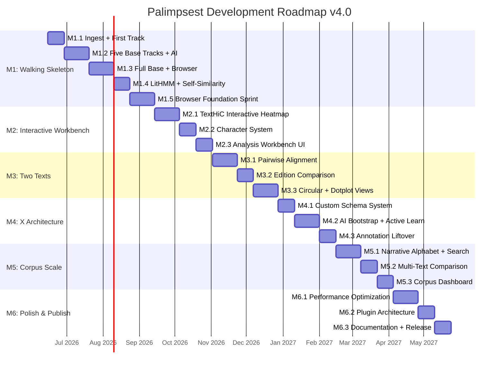

# Palimpsest Development Roadmap v4.0

**Date**: 2026-06-10
**Status**: Enriched roadmap — integrates design review findings, genome browser research, UI redesign plan
**Supersedes**: Roadmap v3.0 (doc 23)
**Inputs**: Design Review (2026-06-10), UCSC/IGV/IGB/JBrowse 2/D-GENIES papers, codebase audit, 4 dot plot papers

---

## Principles (unchanged from v3.0 + 3 additions)

1. **Vertical slices, not horizontal layers.** Every milestone delivers a demonstrable capability.
2. **One text first, two texts second, many texts last.**
3. **The AI assistant is the product.** LLM integration from Milestone 1.
4. **X emerges from Base; never build X into Base.**
5. **Test against ground truth from Day 1.** Swinehart IJ datasets are validation benchmarks.
6. **Degrade gracefully.** Every component has a fallback path.
7. **Vision-gated milestones.** A milestone passes when the *demonstrated capability* matches the vision, not when the code compiles.
8. **UI is the product surface.** *(NEW)* Every analysis capability must be accessible through the browser UI, not just CLI. "How does the user do this?" is a first-class design question.
9. **Tooltips and feedback everywhere.** *(NEW)* Every interactive element has a tooltip. Every action has visual feedback. No silent state changes.
10. **Genome browser, not document viewer.** *(NEW)* The UI follows genome browser paradigms (UCSC, IGV, JBrowse 2): coordinate ruler, stacked tracks, multi-view coordination, progressive detail on zoom. Not a PDF reader with highlights.

---

## Milestone Overview

---

## Key Changes from v3.0

1. **M1 gains M1.5 (Browser Foundation Sprint)** — UI redesign, multi-tab layout, tooltip system, component library, responsive overview bar, highlight toggle fix. This was missing entirely from v3.0.
2. **M2 is resequenced** — Old M2 (Two Texts) becomes M3. New M2 is "Interactive Workbench" covering the TextHiC heatmap redesign, character/coreference system, and analysis workbench. These must come before alignment work because the visualization infrastructure they create is prerequisite for displaying alignment results.
3. **Old M3 (X Architecture) becomes M4** — Unchanged in scope.
4. **Old M4 (Corpus Scale) becomes M5** — Unchanged in scope.
5. **Old M5 (Polish & Publish) becomes M6** — Unchanged in scope, gains plugin extensibility patterns from JBrowse 2 research.

---

## Milestone 1: Walking Skeleton (12-14 weeks)

**Vision gate**: Import a text, see 12 computed tracks in an interactive browser with genome-browser-quality UI, ask the AI assistant to explain what a LitHMM state means. The complete product loop at professional fidelity.

### M1.1–M1.4: Unchanged from v3.0

*All deliverables from v3.0 M1.1–M1.4 carry forward. These phases are functionally COMPLETE as of 2026-06-09.*

**Completion status**: 13 tracks compute, browser renders, AI explain endpoint works, 213 Python tests pass.

### M1.5: Browser Foundation Sprint (3 weeks) *(NEW)*

**Rationale**: The design review (2026-06-10) identified 23 UI gaps including missing tooltips, hardcoded dimensions, no highlight deselection, placeholder heatmap, and no on-demand analysis. These must be fixed before M2's interactive features can be built on a solid foundation.

**PRD coverage**: F-BRW-001 (enriched), F-BRW-006 (enriched), NFR-003 (usability)

**Deliverables**:

#### M1.5a: Component Library + Design System (1 week)
- Install Radix UI primitives + Tailwind CSS (or shadcn/ui)
- Replace all inline styles with design-token-driven components
- Install Floating UI tooltip library; replace ALL native `title` attributes with styled tooltips
- Every interactive element gets a tooltip: track toggles, zoom buttons, toolbar controls, barcode bars, search buttons, detail panel fields
- Design scraping MCP installed and tested against UCSC/IGV/JBrowse for color palette and layout reference
- Consistent color palette, typography, spacing, border-radius across all components

#### M1.5b: Layout Redesign (1 week)
- **Multi-tab layout**: Reading | TextHiC | Characters | Analysis tabs
- **UCSC-inspired toolbar**: Position input (paragraph N / character offset), zoom level display, navigation arrows
- **Coordinate ruler**: Horizontal bar showing full text extent with viewport indicator band
- **Responsive OverviewBar**: CSS `width: 100%` with ResizeObserver, viewport position indicator, track-specific rendering (honor `state-band`, `ab-band` manifest types)
- **Track display modes**: Dense (barcode), Pack (block annotations), Inline (colored spans) — user-selectable per track
- **Track reordering**: Drag-and-drop in TrackPanel
- Fix **highlight toggle bug**: click same paragraph to deselect; click background to clear selection
- Background click handler to clear annotation selection

#### M1.5c: Interaction Polish (1 week)
- **Confidence threshold slider** per track in TrackPanel (wired but no UI currently)
- **Rich annotation hover**: Floating UI popover showing body type, value, confidence, evidence level, text excerpt on hover — not just native `title`
- **OverviewBar hover**: Track name tooltip + annotation preview at mouse position
- **OverviewBar click-drag**: Select a text range by dragging on the barcode
- **Keyboard shortcut expansion**: Tab navigation with visible focus rings, Escape to close any panel
- **Context menu on annotations**: Right-click → "Show all mentions", "Copy text", "Navigate to..."
- **Loading states**: Skeleton loaders for track loading, spinner with per-track progress during import

**Acceptance**: Browser looks and feels like a genome browser workbench, not a prototype. Every element has a tooltip. OverviewBar fills viewport width and shows current position. Multi-tab layout allows TextHiC, characters, and analysis to have dedicated spaces.

---

## Milestone 2: Interactive Workbench (5-6 weeks) *(NEW — was not in v3.0)*

**Vision gate**: Open the TextHiC tab and zoom into a region of high self-similarity. Brush-select a cell → see the two passages side by side. Switch to the Characters tab and filter by "Hal Incandenza" → all mentions highlighted, co-occurrence matrix shows which characters Hal appears with most. Open Analysis tab → re-run sentiment with different parameters → see the track update in real time.

### M2.1: TextHiC Interactive Heatmap (3 weeks)

**PRD coverage**: F-BRW-003 (enriched), F-TRK-007 (enriched)

**Research grounding**: ModDotPlot (Sweeten 2024) hierarchical multi-resolution; D-GENIES (Cabanettes 2018) D3.js zoom + filter sliders; ComplexHeatmap (Gu 2016) annotation tracks on axes; InteractiveComplexHeatmap brush-to-subview pattern; Dot (DNAnexus) D3+Canvas hybrid.

**Deliverables**:
- **Canvas zoom/pan**: 2D transform (translate + scale) on the heatmap canvas, scroll-wheel zoom, click-drag pan
- **Brush-to-zoom**: Click and drag to select a rectangular region → zoom into that sub-matrix (InteractiveComplexHeatmap pattern)
- **Multi-resolution rendering**: At overview zoom, render coarse (paragraph-level) similarity; at detail zoom, render sentence-level similarity within selected paragraphs
- **Axis annotation tracks**: Along both X and Y axes of the heatmap, show miniature density bars for each active track (like ComplexHeatmap row/column annotations)
- **Color scale legend**: Gradient legend showing similarity value range; click to change color palette
- **Color palette picker**: At least 4 palettes (blue sequential, viridis, plasma, diverging red-blue) + custom hex input
- **Similarity threshold slider**: Hide cells below threshold (D-GENIES pattern)
- **Filter controls**: Show/hide diagonal, minimum match size, noise filtering
- **Cell click → passage comparison**: Click a cell → side-by-side panel showing the two passages with differences highlighted
- **Export**: PNG/SVG export of current view
- **Axis labels**: Paragraph numbers or section headings along axes
- **Alignment method selector**: Dropdown to choose similarity metric (cosine, word overlap, Jaccard, edit distance)
- **Self-alignment parameter controls**: Window size, overlap, metric — exposed in a collapsible settings panel

**Acceptance**: The TextHiC view is a professional-quality interactive heatmap comparable to D-GENIES or ModDotPlot. Zoom into a sub-region, see annotation density on axes, click a cell to compare passages.

### M2.2: Character System (2 weeks)

**PRD coverage**: F-TRK-010 (enriched — coreference as entity system, not just a track)

**Deliverables**:
- **Entity index**: Build from coreference + entity annotations — group by `palimpsest:canonicalName`
- **Character panel** (Characters tab): List all characters with:
  - Mention count
  - First/last occurrence (paragraph + offset)
  - Most common co-occurring characters
  - Mention frequency sparkline (density across document)
- **Chain following**: Click a character name → highlight all mentions in Reading view, dim all other text
- **Character co-occurrence heatmap**: Interactive matrix showing which characters share paragraphs/scenes — its own mini-heatmap in the Characters tab
- **Filter by character**: Select one or more characters → only their annotations visible in Reading view
- **Character detail panel**: Click a character → show all unique referent forms (names, pronouns, titles), mention distribution histogram, associated sentiments
- **Master entity record**: Each character has a persistent record with canonical name, aliases, type (person/place/org), user-editable notes

**Acceptance**: Characters tab shows an explorable entity index. Click "Elizabeth Bennet" → all 284 mentions highlighted in Reading view. Co-occurrence matrix shows Elizabeth-Darcy have 47 shared paragraphs.

### M2.3: Analysis Workbench UI (2 weeks)

**PRD coverage**: F-BRW-001 (enriched — analysis from UI, not just CLI)

**Deliverables**:
- **Analysis tab layout**: List of all available track extractors with status (computed / not computed / running / failed)
- **Per-track run button**: "Compute" button for each track that hasn't been computed yet
- **Per-track re-run**: "Re-run with parameters..." opens a parameter dialog
- **Parameter dialogs** for key tracks:
  - LitHMM: number of states, feature selection
  - Topics: number of topics, method (LDA vs NMF)
  - Self-similarity: window size, metric, embedding model
  - Sentiment: method (VADER vs hedonometer), granularity (sentence vs paragraph)
- **Progress indicators**: Per-track progress bar during computation (SSE or polling)
- **Track dependency visualization**: Show which tracks depend on which (LitHMM needs sentiment, lexical, etc.)
- **Import decoupling**: Import now only does text extraction + segmentation. Track analysis is a separate step, triggered from Analysis tab or CLI
- **Batch run**: "Compute all tracks" button with parallelism control

**Acceptance**: User imports an EPUB, sees text with sections/endnotes. Opens Analysis tab, selects which tracks to compute. Watches progress. Adjusts LitHMM to 6 states, re-runs, sees different state assignments.

---

## Milestone 3: Two Texts (5-6 weeks) *(was M2 in v3.0)*

**Vision gate**: Align two texts. See where they're similar and where they diverge. View the comparison in both linear and circular layouts. The first comparative analysis.

### M3.1: Pairwise Text Alignment (3 weeks)
*(Unchanged from v3.0 M2.1)*
- Smith-Waterman alignment with SBERT scoring (GNAT methodology)
- Gumbel-calibrated significance testing
- Narrative alphabet alignment (Foldseek analog)
- Alignment output as PAF records
- Basic alignment visualization (side-by-side text with ribbons)
- **NEW**: Alignment method selector in UI (word, semantic, alphabet) — infrastructure from M2.1

### M3.2: Edition Comparison (2 weeks)
*(Unchanged from v3.0 M2.2)*
- Character-level diff with paragraph-preserving alignment (CollateX methodology)
- Diff statistics: change density per chapter, insertion/deletion/substitution counts
- Diff visualization: color-coded changes inline

### M3.3: Circular + Comparative Views (3 weeks)
*(Enriched from v3.0 M2.3)*
- Circos/circular view for relationship visualization
- **Interactive comparative dotplot**: Two-sequence dot plot using M2.1's canvas zoom/pan infrastructure — NOT rebuilt from scratch. Comparative heatmap showing alignment regions
- **Coordinated multiple views**: Selection in any view propagates to all others (JBrowse 2 pattern)
- **Synteny view**: JBrowse 2-style linear synteny for aligned text passages (horizontal ribbons connecting corresponding regions between two stacked linear views)
- TextHiC heatmap in comparative mode (text A vs text B)

**Vision gate**: Load IJ, open the circular view, see endnote cross-references as arcs. Click an arc → navigate to the passage pair in the linear view. Open comparative dotplot of two editions → see divergent regions as off-diagonal gaps.

---

## Milestone 4: X Architecture (5-6 weeks) *(was M3 in v3.0)*

*(Unchanged in scope from v3.0 M3)*

### M4.1: Custom Schema System (2 weeks)
- Schema editor UI
- PAF format finalized
- LFO v1.0 with >= 100 terms
- W3C Web Annotation import/export

### M4.2: AI Bootstrap + Active Learning (3 weeks)
- AI schema proposal from natural language
- AI-bootstrapped annotation with confidence scores
- Human review UI: accept/reject/correct workflow
- Active learning: retrain after corrections
- Perspectival modeling: every annotation tagged with its generating perspective

### M4.3: Annotation Liftover (2 weeks)
- Alignment-based annotation transfer between texts
- Confidence scoring for transferred annotations
- Transfer visualization showing which annotations mapped and which didn't

---

## Milestone 5: Corpus Scale (5-6 weeks) *(was M4 in v3.0)*

*(Unchanged in scope from v3.0 M4)*

### M5.1: Narrative Alphabet + Corpus Search (3 weeks)
- Narrative alphabet computation for corpus of texts
- Structural similarity search
- Cross-language structural comparison
- Batch processing pipeline

### M5.2: Multi-Text Comparison (2 weeks)
- Multi-text alignment display
- Conserved vs. divergent region identification
- Corpus-level structural clustering

### M5.3: Corpus Dashboard (2 weeks)
- Corpus overview dashboard
- Network graph of inter-text similarities
- Phylogenetic tree of structural relationships
- Batch export for publication

---

## Milestone 6: Polish & Publish (5-6 weeks) *(was M5 in v3.0, enriched)*

### M6.1: Performance Optimization (3 weeks)
- Rust text processing pipeline (PyO3/maturin)
- Web worker rendering for all views
- **Data tiling for heatmaps**: IGV-style pyramidal multi-resolution tiles for TextHiC (pre-compute coarse similarity at multiple zoom levels)
- Tiled rendering for dotplot/heatmap views
- Progressive computation (show early tracks while others compute)
- **Indexed annotation format**: Convert JSONL to indexed format for range queries (analogous to BAM/Tabix)

### M6.2: Plugin Architecture (2 weeks)
- React component plugin registry (inspired by JBrowse 2 plugin system)
- Python track/adapter plugin registry
- **View type plugins**: Custom views can be added as tabs (JBrowse 2 pattern)
- **Renderer plugins**: Custom annotation renderers (IGV pattern: pluggable HeatMapRenderer, BarChartRenderer, etc.)
- Plugin documentation and example plugins
- Third-party visualization component support

### M6.3: Documentation + Release (2 weeks)
- Installation guide (`pip install palimpsest`)
- User documentation with tutorials
- API documentation
- Example projects (IJ, Bible, Origin of Species)
- Version 1.0 release
- Companion paper for DH journal

---

## Total Timeline

| Milestone | Duration | Cumulative |
|-----------|----------|------------|
| M1: Walking Skeleton (+ Browser Foundation) | 13 weeks | 13 weeks |
| M2: Interactive Workbench | 7 weeks | 20 weeks |
| M3: Two Texts | 8 weeks | 28 weeks |
| M4: X Architecture | 7 weeks | 35 weeks |
| M5: Corpus Scale | 7 weeks | 42 weeks |
| M6: Polish & Publish | 7 weeks | 49 weeks |

**Total**: ~49 weeks (12 months) from first commit to v1.0 release. (+10 weeks vs v3.0, entirely from the new M1.5 and M2 phases focused on UI quality.)

---

## Risk Register (updated)

| Risk | Impact | Mitigation |
|------|--------|------------|
| BookNLP fails on modern fiction | Blocks F-TRK-001, 005, 010 | spaCy fallback for all three |
| LitHMM states are uninterpretable | Undermines core innovation | Auto-generate state descriptions; human naming |
| Dotplot/heatmap too slow for full novels | Blocks F-BRW-003 | Tiled rendering + canvas; subsample at low zoom; data tiling (M6.1) |
| AI-bootstrapped annotations too noisy | Undermines X value proposition | Conservative confidence thresholds |
| Narrative alphabet not discriminative | Blocks M5 structural search | Increase alphabet size; fall back to SBERT |
| Plugin architecture too complex | Blocks community adoption | Start with 3 example plugins |
| **Component library adoption slows M1.5** | Delays M2 start | *(NEW)* Keep inline styles as fallback; migrate incrementally |
| **Multi-tab layout breaks existing features** | Regressions | *(NEW)* Feature flags for new layout; keep old layout as fallback |
| **Canvas zoom/pan performance on large texts** | TextHiC unusable for IJ | *(NEW)* Multi-resolution tiling; render at coarse resolution, refine on idle |
| **Design MCP unreliable on JS-heavy sites** | Can't extract genome browser designs | *(NEW)* Fall back to manual screenshot analysis + paper reading |

---

## Design Patterns Catalog (NEW — cross-cutting reference)

### From UCSC Genome Browser
- Horizontal coordinate ruler with position input box
- Multi-level zoom buttons (1.5x, 3x, 10x, 100x, base)
- Track display modes: hide / dense / squish / pack / full
- Track configuration via right-click context menu
- Blue menu bar with navigation tabs

### From IGV
- Google Maps-style click-drag pan + scroll-wheel zoom
- Data tiling: pyramidal multi-resolution pre-computation
- Three-layer architecture: Application → Data → Stream
- Pluggable renderers: HeatMapRenderer, BarChartRenderer, FeatureRenderer
- Sample metadata grouping/sorting/filtering as colored heatmap sidebar
- Multi-locus split-screen view

### From IGB (Integrated Genome Browser)
- Zoom stripe: semi-opaque vertical line as zoom focus anchor
- Animated semantic zooming with continuous transition
- "Color by" feature: right-click → assign heatmap colors based on quantitative attributes
- Thresholding slider: dynamically identify regions exceeding a user-defined value
- Bookmarking scenes: save location + datasets + notes for revisiting
- Right-click context menus with Search Web, BLAST, View Sequence

### From JBrowse 2
- View type system: LinearGenomeView, CircularView, DotplotView, SpreadsheetView, SvInspectorView
- Plugin architecture: plugins add views, tracks, renderers, widgets
- Track configuration with drawer UI (not inline — a slide-out panel)
- Session sharing via URL-encoded state
- Multi-view coordination: selections propagate across linked views
- Synteny view: horizontal ribbons connecting corresponding regions

### From D-GENIES
- Identity color palette with 4 bins + colorblind-safe alternatives
- Match size filtering slider
- Min identity threshold slider
- Line width slider
- Ctrl+scroll zoom, click-to-zoom, Escape to reset
- "Summary" statistics modal with export buttons (TSV/PNG/SVG)
- Noise filtering toggle

### From ComplexHeatmap / InteractiveComplexHeatmap
- Composable HeatmapAnnotation tracks on row/column axes
- Brush-to-subview: select region → zoom into sub-heatmap in detail panel
- Floating tooltip following mouse position
- Parallel heatmaps with synchronized row ordering

### From ModDotPlot
- Hierarchical modimizer index for multi-resolution zoom
- Containment index (alignment-free similarity estimation)
- Interactive mode vs static mode
- Customizable color thresholds (hex input)

---

*This roadmap traces directly to PRD doc 22. Every deliverable maps to a feature requirement. Every vision gate describes the demonstrated capability that proves the milestone delivers on the vision. Design patterns catalog provides cross-cutting reference for implementation decisions.*
